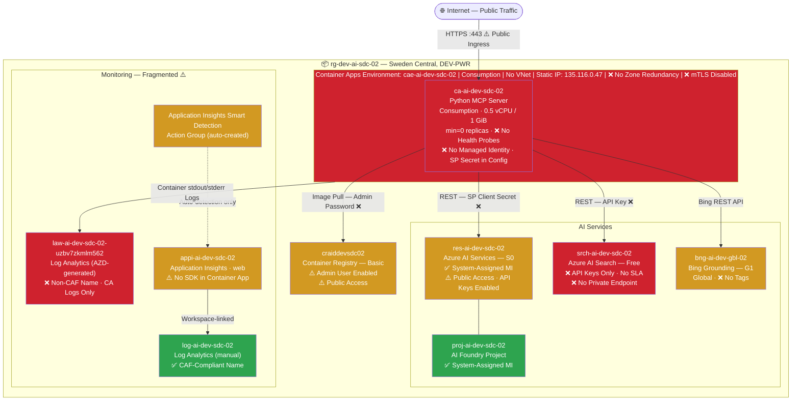
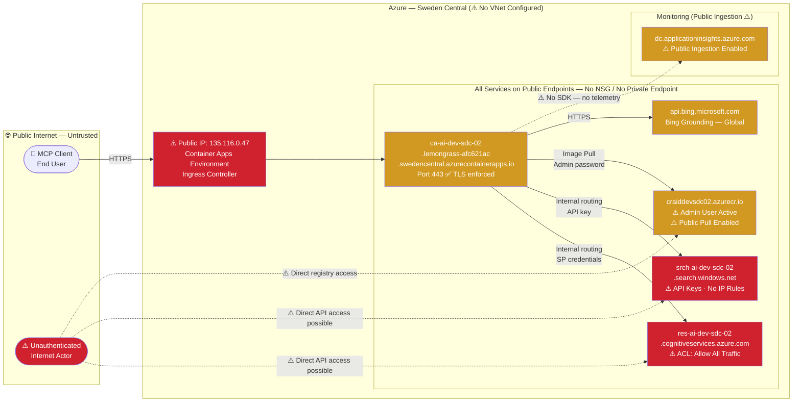
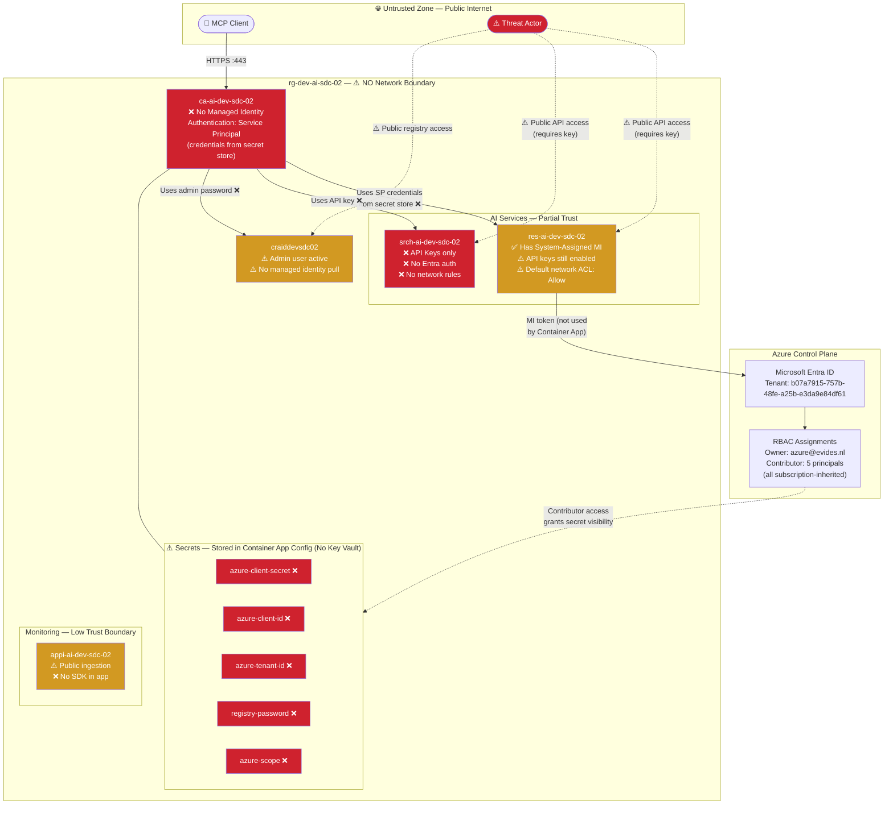
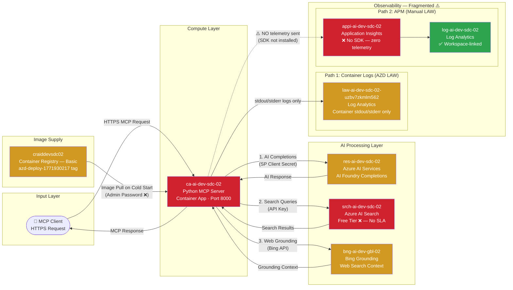

# Discovery Report — rg-dev-ai-sdc-02
### Azure Environment Assessment | DEV-PWR Subscription | Sweden Central

| Field | Value |
|-------|-------|
| **Report Date** | 2026-03-15 |
| **Subscription** | DEV-PWR (`f9a02a85-1b41-4628-aaed-9231e993902c`) |
| **Resource Group** | `rg-dev-ai-sdc-02` |
| **Region** | Sweden Central |
| **Workload** | AI MCP Server (Azure AI Foundry + AI Search + Bing Grounding) |
| **Overall Health Score** | **32 / 100** — Needs Significant Improvement |
| **Prepared By** | GitHub Copilot Reporter Agent |

---

## 1. Executive Summary

The `rg-dev-ai-sdc-02` resource group hosts a Python-based **Model Context Protocol (MCP) server** that provides AI capabilities — including Azure AI Foundry completions, AI Search, and Bing Grounding — to connected clients. The environment was deployed via the `azd` CLI as a development prototype and contains **11 resources** across compute (Container Apps), AI services, a container registry, and monitoring. While the choice of managed PaaS services is architecturally sound for this workload type, the environment has not yet been hardened for production use.

The three most critical risks requiring immediate action are: **(1)** a service principal client secret stored in plain text inside the Container App configuration with no Key Vault, **(2)** the complete absence of network isolation — all services are publicly accessible from the internet with no VNet, NSGs, or private endpoints — and **(3)** the AI Search service running on a Free tier that carries no SLA and cannot support private networking. Across all five Well-Architected Framework pillars, the environment scores **32/100**, with Security and Reliability rated as non-compliant. The immediate priorities are enabling managed identity on the Container App, deploying Azure Key Vault, applying CAF tags to all resources, and configuring diagnostic settings — all of which are low-effort, high-impact actions achievable within a single sprint.

---

## 2. Architecture Diagrams

### 2.1 Architecture Overview

The diagram below shows all 11 resources in `rg-dev-ai-sdc-02`, grouped by function. Resources are color-coded by compliance status: **green** = compliant, **orange** = partial, **red** = non-compliant.



> **Legend**: 🟢 Green = WAF Compliant · 🟠 Orange = Partial Compliance · 🔴 Red = Non-Compliant

---

### 2.2 Network Topology

This diagram highlights the complete absence of network isolation. Every Azure service has a public endpoint reachable from the internet, with no VNet, NSGs, or private endpoints in place.



> **Critical Finding**: There is no network perimeter. AI Services can be called directly from the internet by anyone with an API key. AI Search is similarly exposed. Deploying a VNet with private endpoints is the highest-impact infrastructure change for security posture.

---

### 2.3 Security Boundaries

This diagram maps trust zones and shows how credentials and identity flow across security boundaries.



> **Key Insight**: The AI Services resource (`res-ai-dev-sdc-02`) has a Managed Identity — but the Container App does not. This means the MI on AI Services is unused. The Container App authenticates using a service principal, bypassing the identity layer entirely.

---

### 2.4 Data Flow

This diagram shows how data moves through the system, from user request to AI response, and where the monitoring pipeline breaks down.



> **Monitoring Gap**: Despite Application Insights being provisioned and linked to a Log Analytics workspace, there is zero application-level telemetry because the Python MCP server has no Azure Monitor SDK integration. Only raw container stdout/stderr is available in the AZD-created workspace.

---

## 3. Environment Profile

### 3.1 Resource Summary

| Resource Type | Resource Name | SKU/Tier | Region | Compliance |
|---------------|--------------|----------|--------|-----------|
| Container App | `ca-ai-dev-sdc-02` | Consumption | Sweden Central | ❌ Non-Compliant |
| Container Apps Env | `cae-ai-dev-sdc-02` | Consumption | Sweden Central | ❌ Non-Compliant |
| Azure AI Services | `res-ai-dev-sdc-02` | S0 | Sweden Central | ⚠️ Partial |
| AI Foundry Project | `proj-ai-dev-sdc-02` | — | Sweden Central | ✅ Compliant |
| Azure AI Search | `srch-ai-dev-sdc-02` | **Free** | Sweden Central | ❌ Non-Compliant |
| Container Registry | `craiddevsdc02` | Basic | Sweden Central | ⚠️ Partial |
| Bing Grounding | `bng-ai-dev-gbl-02` | G1 | Global | ⚠️ Partial |
| Log Analytics (AZD) | `law-ai-dev-sdc-02-uzbv7zkmlm562` | PerGB2018 | Sweden Central | ❌ Non-Compliant |
| Log Analytics (manual) | `log-ai-dev-sdc-02` | PerGB2018 | Sweden Central | ✅ Compliant |
| Application Insights | `appi-ai-dev-sdc-02` | web | Sweden Central | ⚠️ Partial |
| Action Group | App Insights Smart Detection | — | Global | ⚠️ Partial |

### 3.2 Resource Counts

| Metric | Value |
|--------|-------|
| Total Resources | 11 |
| Regions | 2 (Sweden Central, Global) |
| Compliant Resources | 2 (18%) |
| Partially Compliant | 5 (45%) |
| Non-Compliant | 4 (36%) |
| Resources with CAF Tags | 0 (0%) |
| Resources with Managed Identity | 3 (`res-ai-dev-sdc-02`, `proj-ai-dev-sdc-02`) |
| Resources with Public Network Access | 7 |
| Resources with Private Endpoints | 0 |

### 3.3 Estimated Monthly Cost Profile

| Resource | SKU | Estimated Monthly Cost |
|---------|-----|----------------------|
| Container Apps | Consumption (0.5 vCPU, 1 GiB, min=0) | ~$5–20 (usage-dependent) |
| Azure AI Services | S0 | Pay-per-use (model charges) |
| Azure AI Search | Free | $0 (no SLA) |
| Container Registry | Basic | ~$5 |
| Log Analytics (×2) | PerGB2018 30d | ~$2–10 (data-dependent) |
| Application Insights | Workspace-based | Included in LAW |
| Bing Grounding | G1 | Pay-per-query |
| **Estimated Total** | | **~$15–40/month** (excl. AI API usage) |

> **Note**: AI API costs (completions, search queries, Bing calls) are the largest variable cost component and are not included above. Recommend Azure Cost Management budget alerts.

### 3.4 Workload Classification

| Attribute | Value |
|-----------|-------|
| Workload Type | AI Agent / MCP Server — Python backend |
| Deployment Method | `azd` CLI (ad-hoc, no tracked IaC) |
| Maturity Stage | **Development / Prototype** |
| Production Readiness | ❌ Not production-ready |
| Data Sensitivity | Medium (AI model access, search indexes) |
| Traffic Profile | On-demand, low-frequency (scales to zero) |

---

## 4. WAF Compliance Dashboard

### 4.1 Pillar Ratings

| WAF Pillar | Rating | Score | Top Finding |
|------------|--------|-------|-------------|
| 🔴 **Security** | ❌ Non-Compliant | 18/100 | No Key Vault; SP secret in plain text; no network isolation |
| 🔴 **Reliability** | ❌ Non-Compliant | 20/100 | No zone redundancy; scales to zero; no health probes; no SLA (Free Search) |
| 🟠 **Cost Optimization** | ⚠️ Partial | 45/100 | AI Search Free tier; duplicate LAW workspaces; no budget alerts |
| 🟠 **Operational Excellence** | ⚠️ Partial | 40/100 | Zero tags; no IaC; no alerts; no diagnostic settings; no CI/CD |
| 🟠 **Performance Efficiency** | ⚠️ Partial | 42/100 | Cold starts; no scale rules; Free Search bottleneck; no caching |
| **Overall** | ❌ | **32/100** | |

### 4.2 Key Findings Per Pillar

#### Security (18/100)
1. ❌ **No Key Vault** — 5 secrets stored as Container App plain-text config values
2. ❌ **No Managed Identity on Container App** — service principal credentials in use
3. ❌ **No network isolation** — no VNet, no NSGs, no private endpoints on any resource

#### Reliability (20/100)
1. ❌ **No zone redundancy** — existing Container Apps Environment cannot be made zone-redundant without recreation
2. ❌ **`minReplicas=0`** — MCP server scales to zero causing cold-start timeouts
3. ❌ **No health probes** — unhealthy replicas receive traffic; no self-healing

#### Cost Optimization (45/100)
1. ⚠️ **AI Search Free tier** — no SLA, shared infrastructure, cannot support production
2. ⚠️ **Duplicate Log Analytics workspaces** — unnecessary cost and operational complexity
3. ⚠️ **No budget alerts** — AI API spend is unmonitored

#### Operational Excellence (40/100)
1. ❌ **Zero CAF tags** — 0/44 required tag values present across 11 resources
2. ❌ **No alert rules** — zero proactive notifications; only auto-created Smart Detection
3. ❌ **No diagnostic settings** on AI Services, AI Search, or Container Registry

#### Performance Efficiency (42/100)
1. ⚠️ **Cold starts** — `minReplicas=0` on Python container causes 10–30s delays
2. ⚠️ **No KEDA scale rules** — uncontrolled autoscaling under load
3. ⚠️ **AI Search Free tier throttling** — unpredictable latency, shared infrastructure

---

## 5. CAF Compliance Summary

### 5.1 Naming Conventions

**Score: 7 Compliant / 2 Partial / 1 Non-Compliant out of 11 resources**

| Resource | Name | CAF Verdict | Issue |
|----------|------|-------------|-------|
| Resource Group | `rg-dev-ai-sdc-02` | ⚠️ Partial | Env before workload; CAF standard: `rg-ai-dev-sdc-02` |
| Container App | `ca-ai-dev-sdc-02` | ✅ | Correct pattern |
| Container Apps Env | `cae-ai-dev-sdc-02` | ✅ | Consistent and clear |
| AI Services | `res-ai-dev-sdc-02` | ⚠️ Partial | Prefix `res` is generic; CAF recommends `cog` |
| AI Foundry Project | `proj-ai-dev-sdc-02` | ✅ | No formal CAF prefix; consistent |
| AI Search | `srch-ai-dev-sdc-02` | ✅ | Follows CAF exactly |
| Container Registry | `craiddevsdc02` | ✅ | Platform forces no hyphens; concatenation is expected |
| Log Analytics (AZD) | `law-ai-dev-sdc-02-uzbv7zkmlm562` | ❌ | Wrong prefix (`law` not `log`); random AZD suffix |
| Log Analytics | `log-ai-dev-sdc-02` | ✅ | Correct |
| Application Insights | `appi-ai-dev-sdc-02` | ✅ | Follows CAF exactly |
| Bing Grounding | `bng-ai-dev-gbl-02` | ✅ | Consistent; `gbl` for global appropriate |

### 5.2 Tagging

**Score: 0 / 44 required tag values — Complete Non-Compliance**

No resource in the group has any CAF-required tags (`environment`, `workload`, `owner`, `costCenter`). The only tag present is `azd-service-name=mcp-server` on the Container App, which is a tooling tag, not a governance tag.

**Recommended immediate tag values:**

```bash
environment = dev
workload    = ai-mcp-server
owner       = alberto.aguzzi@evides.nl
costCenter  = <billing code to be confirmed>
```

### 5.3 Resource Organization

| Criterion | Status | Notes |
|-----------|--------|-------|
| Workload isolated in dedicated RG | ✅ | All resources scoped to `rg-dev-ai-sdc-02` |
| Subscription scoped to environment | ✅ | DEV-PWR is environment-specific |
| Logical grouping by function | ✅ | AI, compute, monitoring co-located |
| RBAC scoped to resource group | ❌ | All assignments are subscription-inherited |
| Networking in separate RG | ❌ | No networking layer exists yet |
| Management group hierarchy | N/A | Not assessed at this level |

---

## 6. Risk Register

### 6.1 Critical Risks (P1)

| ID | Risk | Affected Resource | Likelihood | Impact | Effort to Fix |
|----|------|------------------|-----------|--------|--------------|
| P1-01 | **Client secret stored in plain text** — `azure-client-secret` in Container App config; accessible to all Contributor principals | `ca-ai-dev-sdc-02` | High | Critical | Medium |
| P1-02 | **No Managed Identity on Container App** — SP credentials grant persistent access to AI Services; no rotation | `ca-ai-dev-sdc-02` | High | Critical | Low |
| P1-03 | **ACR Admin User active and used for image pull** — shared static password; full registry access if leaked | `craiddevsdc02` | Medium | High | Low |

### 6.2 High Risks (P2)

| ID | Risk | Affected Resource | Likelihood | Impact | Effort to Fix |
|----|------|------------------|-----------|--------|--------------|
| P2-01 | **No network isolation** — all Azure services on public endpoints; no VNet, NSG, or private endpoints | All resources | High | High | High |
| P2-02 | **AI Services API keys enabled** — any leaked key provides full API access from any IP | `res-ai-dev-sdc-02` | Medium | High | Low |
| P2-03 | **AI Search API keys only** — no Entra ID authentication; no per-call attribution | `srch-ai-dev-sdc-02` | Medium | High | Low (requires tier upgrade for private endpoint) |
| P2-04 | **No diagnostic settings** on AI Services, Search, ACR — security events invisible | 3 resources | High | High | Low |
| P2-05 | **mTLS disabled** in Container Apps Environment — east-west traffic unencrypted | `cae-ai-dev-sdc-02` | Low | Medium | Low |

### 6.3 Medium Risks (P3)

| ID | Risk | Affected Resource | Likelihood | Impact | Effort to Fix |
|----|------|------------------|-----------|--------|--------------|
| P3-01 | **Zero tags** — no cost attribution, no owner accountability | All 11 resources | — | Medium | Low (Quick Win) |
| P3-02 | **minReplicas=0** — MCP server cold starts cause 10–30s delays and potential client timeouts | `ca-ai-dev-sdc-02` | High | Medium | Low (Quick Win) |
| P3-03 | **No alert rules** — silent failures; no proactive incident response | Resource group | High | Medium | Low (Quick Win) |
| P3-04 | **No health probes** — unhealthy replicas receive traffic | `ca-ai-dev-sdc-02` | Medium | Medium | Low |
| P3-05 | **AI Search on Free tier** — no SLA; 3 index limit; shared infrastructure | `srch-ai-dev-sdc-02` | — | Medium | Low (new service required) |
| P3-06 | **Two Log Analytics workspaces** — fragmented observability, duplicate ingestion cost | Both LAW resources | — | Low | Low |

### 6.4 Low Risks (P4)

| ID | Risk | Affected Resource | Likelihood | Impact | Effort to Fix |
|----|------|------------------|-----------|--------|--------------|
| P4-01 | **No App Insights SDK in Python app** — zero APM telemetry | `ca-ai-dev-sdc-02` | — | Medium | Low |
| P4-02 | **No Defender for Containers** — no image scanning, no runtime threat detection | `craiddevsdc02` | Low | Medium | Low |
| P4-03 | **No TLS minimum version set** on AI Services | `res-ai-dev-sdc-02` | Low | Medium | Low |
| P4-04 | **No budget alerts** — unchecked AI API spend (completions, search, Bing) | Subscription | Medium | Low | Low |
| P4-05 | **No CI/CD pipeline** — manual `azd` deployments, no drift detection | All resources | — | Medium | Medium |

---

## 7. Actionable Recommendations

Listed by priority. Quick Wins can be completed in under 2 hours each.

| # | Recommendation | Affected Resources | Effort | Expected Benefit |
|---|---------------|-------------------|--------|-----------------|
| **1** | **Enable Managed Identity on Container App** — enable System-Assigned MI; assign `Cognitive Services User` on AI Services and `AcrPull` on ACR; remove `azure-client-id`, `azure-client-secret` env vars | `ca-ai-dev-sdc-02` | ⚡ Quick Win | Eliminates P1-02; removes credential exposure; enables KV integration |
| **2** | **Deploy Azure Key Vault and migrate secrets** — create KV; move `azure-client-secret` + `registry-password` to KV secrets; reference from Container App via MI | New KV + `ca-ai-dev-sdc-02` | Medium | Eliminates P1-01; enforces secret lifecycle; audit trail |
| **3** | **Disable ACR Admin User** — after enabling MI (step 1), disable admin user; remove `registry-password` secret | `craiddevsdc02` | ⚡ Quick Win | Eliminates P1-03; no ongoing credential rotation needed |
| **4** | **Apply CAF tags to all resources** — apply `environment=dev`, `workload=ai-mcp-server`, `owner`, `costCenter` via `az tag update` or IaC; enforce with Azure Policy | All 11 resources | ⚡ Quick Win | Addresses P3-01; enables cost attribution; policy compliance |
| **5** | **Configure diagnostic settings** — route audit/request logs from AI Services, AI Search, and ACR to `log-ai-dev-sdc-02` | 3 resources | ⚡ Quick Win | Addresses P2-04; enables security investigation; minimal ingestion cost |
| **6** | **Set minReplicas=1 and define scale rules** — `az containerapp update --min-replicas 1`; add HTTP concurrency scale rule | `ca-ai-dev-sdc-02` | ⚡ Quick Win | Eliminates cold starts; adds ~$5/month baseline compute cost |
| **7** | **Define alert rules** — HTTP 5xx rate > 1%, replica count anomalies, AI throttling, budget 80%/100% thresholds | Resource group | ⚡ Quick Win | Addresses P3-03; enables proactive incident response |
| **8** | **Consolidate Log Analytics workspaces** — update Container Apps Environment log destination to `log-ai-dev-sdc-02`; delete `law-ai-dev-sdc-02-uzbv7zkmlm562` | Both LAW resources | ⚡ Quick Win | Addresses P3-06; unified observability; eliminates duplicate ingestion cost |
| **9** | **Upgrade AI Search from Free to Basic tier** — provision new `srch-ai-dev-sdc-02` at Basic SKU; migrate index definitions; delete Free tier service | `srch-ai-dev-sdc-02` | Medium | Addresses P3-05; SLA 99.9%; enables private endpoint and RBAC auth |
| **10** | **VNet injection and private endpoints (pre-production)** — create VNet `/16` with `/23` subnet for Container Apps; new zone-redundant environment; private endpoints for ACR, AI Services, AI Search | All resources | Large | Addresses P2-01; enables zone redundancy; eliminates all public service access |

### Recommended Sprint Roadmap

```
Sprint 1 (1–2 days) — Identity & Quick Wins:
  ✓ Rec 1: Enable Managed Identity + role assignments
  ✓ Rec 3: Disable ACR admin user
  ✓ Rec 4: Apply CAF tags
  ✓ Rec 5: Configure diagnostic settings
  ✓ Rec 6: Set minReplicas=1 + scale rules
  ✓ Rec 7: Create alert rules
  ✓ Rec 8: Consolidate Log Analytics workspaces

Sprint 2 (3–5 days) — Secrets & Monitoring:
  ✓ Rec 2: Deploy Key Vault + migrate secrets
  ✓ Rec 9: Upgrade AI Search to Basic tier
  ✓ Add App Insights SDK to Python MCP server
  ✓ Implement azd pipeline (CI/CD)

Sprint 3 (1–2 weeks) — Network Hardening (pre-production):
  ✓ Rec 10: VNet injection + zone-redundant environment
  ✓ Private endpoints for all AI services
  ✓ Disable public network access on AI Services + Search
  ✓ Enable mTLS in Container Apps Environment
```

---

## 8. Appendix

### A. Full Resource Inventory Reference

| Name | Type | SKU | Region | MI | Public Access | Tags |
|------|------|-----|--------|----|--------------|------|
| `ca-ai-dev-sdc-02` | Container App | Consumption | SWC | ❌ | ✅ | 1 (azd only) |
| `cae-ai-dev-sdc-02` | CA Environment | Consumption | SWC | — | ✅ | ❌ |
| `res-ai-dev-sdc-02` | AI Services | S0 | SWC | ✅ | ✅ | ❌ |
| `proj-ai-dev-sdc-02` | AI Foundry Project | — | SWC | ✅ | — | ❌ |
| `srch-ai-dev-sdc-02` | AI Search | Free | SWC | — | ✅ | ❌ |
| `craiddevsdc02` | Container Registry | Basic | SWC | — | ✅ | ❌ |
| `bng-ai-dev-gbl-02` | Bing Grounding | G1 | Global | — | — | ❌ |
| `law-ai-dev-sdc-02-uzbv7zkmlm562` | Log Analytics | PerGB2018 | SWC | — | — | ❌ |
| `log-ai-dev-sdc-02` | Log Analytics | PerGB2018 | SWC | — | — | ❌ |
| `appi-ai-dev-sdc-02` | App Insights | web | SWC | — | ✅ | ❌ |
| App Insights Smart Detection | Action Group | — | Global | — | — | — |

### B. RBAC Principals (Subscription-Inherited)

| Principal | Type | Role |
|-----------|------|------|
| `azure@evides.nl` | User | Owner |
| `m.super@evides.nl` | User | Contributor |
| `B2B.Role.Aumatics_DevOps_Engineers` | Group | Contributor |
| `B2B.Role.Aumatics_Architects` | Group | Contributor |
| `AZR-IAM-DEV-PWR-Contributor` | Group | Contributor |
| Orca Security DSPM Scanner | Service Principal | Reader + custom |

> All RBAC is subscription-inherited. No resource-group-scoped assignments exist. Recommend adding RG-scoped assignments with least-privilege roles per principal.

### C. Assessment Methodology

This assessment was performed by the GitHub Copilot Discoverer and Reviewer Agents using:
- **Azure CLI** (`az resource list`, `az containerapp show`, `az cognitiveservices account show`, `az search service show`, `az acr show`, `az monitor`) to enumerate and interrogate all resources
- **Microsoft Learn MCP Server** to retrieve current WAF and CAF guidance documents
- **WAF Framework References**: [Azure Well-Architected Framework](https://learn.microsoft.com/azure/well-architected/), [Container Apps best practices](https://learn.microsoft.com/azure/well-architected/service-guides/azure-container-apps), [CAF Secure AI PaaS](https://learn.microsoft.com/azure/cloud-adoption-framework/scenarios/ai/platform/security)
- **Scan Date**: 2026-03-14 (inventory) / 2026-03-15 (assessment + report)

### D. Next Steps (Optional)

If the team wishes to plan a migration or architectural uplift, the **Migration Planner** agent can produce a PaaS migration plan covering:
- VNet architecture design for this workload
- Private endpoint topology
- Zone-redundant Container Apps Environment recreation plan
- AI Search tier upgrade and index migration
- Cost impact analysis for recommended changes

To invoke: use `@migration-planner` or `/disc-4-migrate` (if configured).

---

*Report generated by GitHub Copilot Reporter Agent on 2026-03-15. Based on discovery scan of 2026-03-14.*
