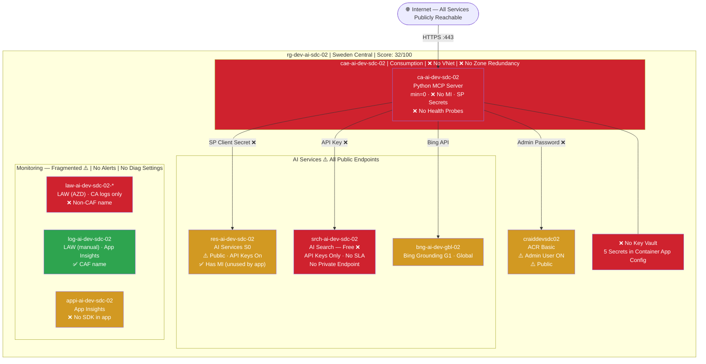
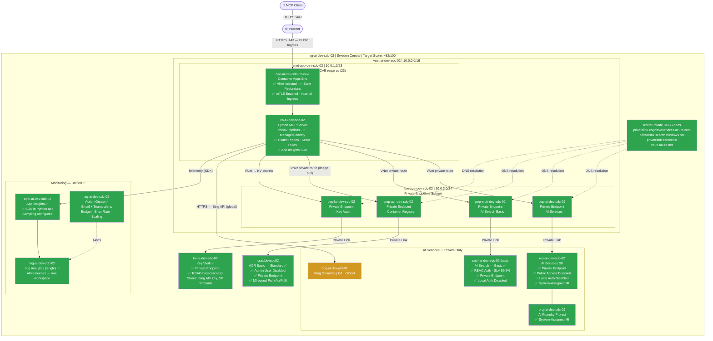
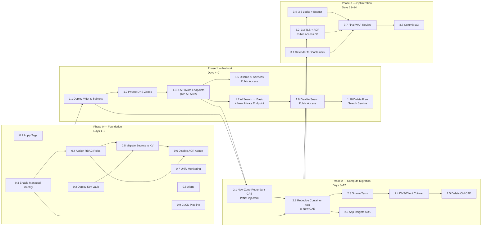

# Migration Plan — rg-dev-ai-sdc-02
### PaaS Architecture Uplift | DEV → Production-Ready | Sweden Central

| Field | Value |
|-------|-------|
| **Plan Date** | 2026-03-15 |
| **Subscription** | DEV-PWR (`f9a02a85-1b41-4628-aaed-9231e993902c`) |
| **Resource Group** | `rg-dev-ai-sdc-02` (current) → `rg-ai-dev-sdc-02` (CAF-corrected) |
| **Workload** | AI MCP Server — Python (Azure AI Foundry + AI Search + Bing Grounding) |
| **Migration Type** | PaaS Architecture Uplift (environment is already PaaS — focus is hardening) |
| **Prepared By** | GitHub Copilot Migration Planner Agent |
| **Based On** | discovery-inventory.md · waf-assessment.md · discovery-report.md |

---

## 1. Migration Summary

### Current State

The environment is an **already-PaaS workload** — a Python MCP server running on Azure Container Apps, backed by Azure AI Services, AI Search, and Bing Grounding. It was deployed ad-hoc via `azd` CLI as a prototype. The current environment scores **32/100** on the Well-Architected Framework, with Security and Reliability rated as non-compliant. There are no VMs to migrate; instead, the migration is an **architecture uplift** to harden the existing PaaS resources to production standards.

### Target State Vision

The target architecture keeps the same core PaaS services but adds:
- **Network isolation**: VNet injection, private endpoints on all data services, internal ingress for the Container App
- **Identity hardening**: Managed Identity on the Container App, Key Vault for all secrets, no static credentials
- **Reliability**: Zone-redundant Container Apps Environment (`minReplicas=2`), health probes, explicit scale rules
- **Operational excellence**: Unified Log Analytics workspace, diagnostic settings on all resources, CI/CD pipeline, full CAF tagging
- **AI Search upgrade**: Free tier → Basic tier (SLA, private endpoint, RBAC auth)

### Expected Benefits

| Benefit | Metric |
|---------|--------|
| Security posture | 18/100 → ~85/100 |
| WAF overall score | 32/100 → ~82/100 |
| SLA | No SLA → 99.9% composite |
| Credential exposure | 5 plain-text secrets → 0 |
| Public attack surface | 7 public endpoints → 1 (Container App ingress only) |
| Observability | stdout/stderr only → full APM + audit logs |
| Monthly cost delta | +~$120–160/month (VNet, Key Vault, zone redundancy, AI Search Basic) |

---

## 2. Current-State Architecture



---

## 3. Target-State Architecture



---

## 4. Resource Migration Map

| Current Resource | Current Config | Target Config | Migration Action | Complexity |
|-----------------|---------------|---------------|-----------------|-----------|
| `rg-dev-ai-sdc-02` | No tags; `dev` before workload in name | `rg-ai-dev-sdc-02` | Rename + apply CAF tags | Low |
| `ca-ai-dev-sdc-02` | No MI; SP secrets; min=0; no probes | Same name; System-Assigned MI; min=2; probes; scale rules | In-place update | Low |
| `cae-ai-dev-sdc-02` | No VNet; no zone redundancy; mTLS off | **New** `cae-ai-dev-sdc-02-new`; VNet-injected; zone-redundant; mTLS on | Create new; migrate CA; delete old | High |
| `res-ai-dev-sdc-02` | Public access; allow-all ACL; local auth on | Same name; public access off; private endpoint; `disableLocalAuth: true` | In-place update | Low |
| `proj-ai-dev-sdc-02` | ✅ Already compliant | No change needed | None | None |
| `srch-ai-dev-sdc-02` (Free) | Free SKU; API keys only; no PE | **New** `srch-ai-dev-sdc-02-basic` at Basic; RBAC; private endpoint | New service (cannot upgrade from Free); migrate indexes; delete old | Medium |
| `craiddevsdc02` | Admin user on; public; no PE | Same name; admin user off; private endpoint; ACR Standard for geo-rep | In-place update + PE | Low |
| `bng-ai-dev-gbl-02` | No tags; G1 global | Same name; add CAF tags; add budget alert | Apply tags; add alert | Low |
| `law-ai-dev-sdc-02-uzbv7zkmlm562` | AZD-generated; non-CAF name; CA logs only | **Delete** — migrate logs to `log-ai-dev-sdc-02` | Reconfigure CAE log destination; delete | Low |
| `log-ai-dev-sdc-02` | ✅ Good name; no diag settings fed into it | Same name; add diagnostic settings from AI Services, Search, ACR | Configure diagnostic settings | Low |
| `appi-ai-dev-sdc-02` | No SDK in app; public ingestion | Same name; add `APPLICATIONINSIGHTS_CONNECTION_STRING` to CA; instrument Python; private ingestion | App code change + env var | Low |
| *(new)* Key Vault | Not present | `kv-ai-dev-sdc-02`; private endpoint; RBAC | Create new | Low |
| *(new)* VNet | Not present | `vnet-ai-dev-sdc-02` (10.0.0.0/16) with subnets | Create new | Medium |
| *(new)* Private DNS Zones | Not present | 4 zones (cognitiveservices, search, acr, vault) | Create new | Low |
| *(new)* Action Group | Smart Detection only | `ag-ai-dev-sdc-02`; email + Teams | Create new | Low |
| *(new)* Alert Rules | None | 5+ metric and budget alerts | Create new | Low |

---

## 5. Migration Phases

### Phase 0 — Foundation (Days 1–3)
**Goal**: Establish all shared infrastructure that everything else depends on. Zero downtime to existing environment.

| Task | Resource(s) | Action | Acceptance Criteria |
|------|------------|--------|---------------------|
| 0.1 Apply CAF tags | All 11 resources | `az tag update --operation Merge` | All resources have `environment`, `workload`, `owner`, `costCenter` |
| 0.2 Deploy Azure Key Vault | New `kv-ai-dev-sdc-02` | Bicep/azd; RBAC access model; soft-delete + purge protection on | KV deployed; `az keyvault show` returns provisioning succeeded |
| 0.3 Enable Managed Identity on Container App | `ca-ai-dev-sdc-02` | `az containerapp identity assign --system-assigned` | Identity principal ID returned; visible in Entra ID |
| 0.4 Assign RBAC roles for Managed Identity | `ca-ai-dev-sdc-02` MI | `Cognitive Services User` on AI Services; `AcrPull` on ACR; `Key Vault Secrets User` on KV | `az role assignment list` shows 3 assignments for MI principal |
| 0.5 Migrate secrets to Key Vault | `kv-ai-dev-sdc-02` | Add `azure-client-secret`, `registry-password` as KV secrets; update CA secret references | CA running successfully after secret reference update |
| 0.6 Disable ACR Admin User | `craiddevsdc02` | `az acr update --admin-enabled false`; remove `registry-password` from CA | ACR admin disabled; CA pulls image successfully via MI |
| 0.7 Set up unified monitoring | `log-ai-dev-sdc-02` | Configure diagnostic settings on AI Services, ACR; update CAE to use `log-ai-dev-sdc-02`; delete AZD LAW | All resources sending logs to single workspace |
| 0.8 Create Action Group + Alerts | New `ag-ai-dev-sdc-02` | Email + Teams webhook; 5 metric alerts | Test alert fires on demand |
| 0.9 Configure CI/CD pipeline | GitHub Actions | `azd pipeline config`; add container scan step | Pipeline runs end-to-end on commit |

**Acceptance Criteria (Phase 0)**:  
- ✅ No secrets in Container App config (all resolved via KV)  
- ✅ Managed identity performing ACR pulls (no admin password)  
- ✅ All resources tagged with 4 CAF tags  
- ✅ Single Log Analytics workspace receiving logs from all resources  
- ✅ At least 3 alert rules active  
- ✅ CI/CD pipeline green  

**Rollback**: Phase 0 tasks are additive/non-destructive. Rollback = re-add static secrets to CA config and re-enable ACR admin user. No downtime required to roll back.

---

### Phase 1 — Network Foundation (Days 4–7)
**Goal**: Build the network perimeter that enables private endpoint isolation. Still no disruption to existing running environment.

| Task | Resource(s) | Action | Acceptance Criteria |
|------|------------|--------|---------------------|
| 1.1 Deploy VNet | New `vnet-ai-dev-sdc-02` | `/16` address space; 3 subnets: `/23` for CAE, `/24` for PE, `/24` reserved | VNet deployed; subnets created; no subnet conflicts |
| 1.2 Deploy Private DNS Zones | 4 new zones | `privatelink.cognitiveservices.azure.com`, `privatelink.search.windows.net`, `privatelink.azurecr.io`, `privatelink.vaultcore.azure.net`; link to VNet | DNS zones resolving private IPs when queried from VNet |
| 1.3 Deploy Private Endpoint — Key Vault | `pep-kv-dev-sdc-02` | PE in `snet-pe-dev-sdc-02`; DNS registration | KV resolves to private IP from VNet |
| 1.4 Deploy Private Endpoint — AI Services | `pep-ai-dev-sdc-02` | PE in `snet-pe-dev-sdc-02`; DNS registration | AI Services endpoint resolves to private IP |
| 1.5 Deploy Private Endpoint — ACR | `pep-acr-dev-sdc-02` | PE in `snet-pe-dev-sdc-02`; DNS registration | ACR login server resolves to private IP |
| 1.6 Disable public access on AI Services | `res-ai-dev-sdc-02` | `publicNetworkAccess: Disabled`; `disableLocalAuth: true` | Direct HTTP calls to public endpoint return 403; MI auth works from VNet |
| 1.7 Upgrade AI Search to Basic | New `srch-ai-dev-sdc-02-basic` | Deploy new Basic-tier service; export index definitions; re-import; enable RBAC; disable local auth; add `Search Index Data Reader` role to CA MI | New search service operational; index queries return results; old Free service still running in parallel |
| 1.8 Deploy Private Endpoint — AI Search | `pep-srch-dev-sdc-02` | PE to new Basic search service; DNS registration | Search resolves to private IP |
| 1.9 Disable public access on AI Search | `srch-ai-dev-sdc-02-basic` | `publicNetworkAccess: Disabled` | Public endpoint returns 403 |
| 1.10 Delete old AI Search Free service | `srch-ai-dev-sdc-02` | After validation of new service | Free service deleted |

**Acceptance Criteria (Phase 1)**:  
- ✅ Private endpoints deployed for KV, AI Services, ACR, AI Search  
- ✅ Private DNS zones resolving correct IPs  
- ✅ AI Services public access disabled; MI auth confirmed working  
- ✅ AI Search Basic operational with RBAC; Free tier deleted  
- ✅ No disruption to Container App (still on public CAE at this point, reaches PE via VNet after Phase 2)  

**Rollback**: Private endpoints and DNS zones are additive. Re-enable public access on AI Services and AI Search. Re-enable local auth. Restore CA to use API key. Delete PE and DNS resources.

---

### Phase 2 — Compute Migration (Days 8–12)
**Goal**: Migrate the Container App to the new zone-redundant, VNet-injected Container Apps Environment. **This phase involves planned downtime of ~5–10 minutes for DNS cutover.**

| Task | Resource(s) | Action | Acceptance Criteria |
|------|------------|--------|---------------------|
| 2.1 Create zone-redundant CAE | New `cae-ai-dev-sdc-02-new` | VNet-inject into `snet-app-dev-sdc-02` (`/23`); zone redundancy enabled; mTLS enabled; peer traffic encryption on; log destination = `log-ai-dev-sdc-02` | New CAE provisioned; `zoneRedundant: true` confirmed |
| 2.2 Redeploy Container App to new CAE | `ca-ai-dev-sdc-02` | Deploy to new CAE; set `minReplicas=2`; add health probes; add HTTP concurrency scale rule; set `APPLICATIONINSIGHTS_CONNECTION_STRING`; use MI for all auth | Green health probes; 2 replicas running in new CAE |
| 2.3 Validate end-to-end in new CAE | All | Run smoke tests against new CAE FQDN | All AI calls (completions, search, grounding) succeed; App Insights telemetry received |
| 2.4 Update DNS / client config | Client configuration | Update MCP client endpoints to new CAE domain | Client traffic routing to new deployment |
| 2.5 Delete old Container Apps Environment | `cae-ai-dev-sdc-02` | After smoke test validation + 24h bake period | Old CAE deleted; no active traffic |
| 2.6 Add App Insights SDK to Python MCP server | App code | Install `azure-monitor-opentelemetry`; configure with connection string | Requests, dependencies, and exceptions visible in App Insights |

**Acceptance Criteria (Phase 2)**:  
- ✅ Container App running on zone-redundant VNet-injected CAE  
- ✅ `minReplicas=2`; health probes green; scale rules active  
- ✅ All AI service calls using Managed Identity (no SP credentials)  
- ✅ App Insights showing live telemetry  
- ✅ Old public-endpoint CAE deleted  

**Rollback**: Redeploy Container App to original `cae-ai-dev-sdc-02` (retain it during 24h bake period). Re-point clients to original FQDN. Full rollback in <15 minutes.

---

### Phase 3 — Optimization & Validation (Days 13–14)
**Goal**: Final security hardening, right-size resources, validate entire architecture against WAF/CAF.

| Task | Resource(s) | Action | Acceptance Criteria |
|------|------------|--------|---------------------|
| 3.1 Enable Defender for Containers | Subscription | Enable at subscription level via Defender for Cloud | Container image scans visible in Defender for Cloud |
| 3.2 Set TLS minimum on AI Services | `res-ai-dev-sdc-02` | `minTlsVersion: TLS12` | `az cognitiveservices account show` shows `minTlsVersion: TLS12` |
| 3.3 Disable public access on ACR | `craiddevsdc02` | `publicNetworkAccess: Disabled`; image pull tested via private endpoint | Image pull succeeds; no public access |
| 3.4 Configure resource locks | RG level | Apply `CanNotDelete` lock on KV, VNet, Log Analytics | Lock prevents accidental deletion |
| 3.5 Add budget alert | Subscription/RG | Azure Budget at 80% and 100% of estimated monthly spend | Test alert fires at threshold |
| 3.6 Performance baseline | `ca-ai-dev-sdc-02` | Run load test; capture P50/P95/P99 latency; compare to old environment | Performance within acceptable bounds |
| 3.7 Final WAF/CAF review | All | Re-run assessment checklist | Target score ≥ 80/100 |
| 3.8 Update IaC files | Bicep/azd | Export final state as tracked Bicep; commit to repo; configure drift detection | IaC reflects deployed state; pipeline validates on PR |
| 3.9 Operations runbook | Docs | Document runbook: key rotation, scale adjustment, incident response | Runbook reviewed by team |

**Acceptance Criteria (Phase 3)**:  
- ✅ Defender for Containers active; no critical CVEs in running image  
- ✅ All public access disabled on AI Services, Search, ACR  
- ✅ Resource locks in place  
- ✅ Budget alerts configured  
- ✅ WAF score ≥ 80/100  
- ✅ Full IaC in source control  

**Rollback**: Phase 3 is validation and additive. No rollback required.

---

## 6. Migration Phase Dependency Diagram



---

## 7. Risk Register

### 7.1 High Risks

| ID | Risk | Phase | Likelihood | Impact | Mitigation | Rollback |
|----|------|-------|-----------|--------|-----------|---------|
| R-01 | **Container App fails to pull image from ACR via private endpoint** after PE deployment — DNS resolution may not work correctly from old public CAE | Phase 1 | Medium | High | Validate ACR PE from a test container before disabling admin user; keep admin user as fallback until Phase 2 | Re-enable ACR public access; restore admin user secret |
| R-02 | **Zone-redundant CAE creation fails** — Sweden Central may have capacity constraints for dedicated zone-redundant capacity | Phase 2 | Low | High | Check `az containerapp env create` capacity first; have fallback plan to remain on non-zone-redundant environment temporarily | Continue with original CAE; defer zone redundancy |
| R-03 | **AI Search index migration loses data or breaks queries** — schema differences between Free and Basic tier | Phase 1 | Medium | Medium | Export index schema with `az search index show`; validate query results against both services in parallel for 24h before switching | Restore CA to use old Free search service (remains running until explicitly deleted) |
| R-04 | **Client MCP connections break during CAE DNS cutover** — existing long-lived connections to old FQDN | Phase 2 | Medium | Medium | Schedule cutover during low-traffic window; notify all MCP clients in advance; keep old CAE running for 24h | Revert client configuration to old FQDN; old CAE available for 24h bake period |

### 7.2 Medium Risks

| ID | Risk | Phase | Likelihood | Impact | Mitigation | Rollback |
|----|------|-------|-----------|--------|-----------|---------|
| R-05 | **Python MCP server fails to start with App Insights SDK** — dependency conflicts or missing config | Phase 2 | Low | Medium | Add SDK in Phase 2 after CA is running in new CAE; use feature flag env var to enable/disable | Remove `APPLICATIONINSIGHTS_CONNECTION_STRING` env var; SDK gracefully degrades |
| R-06 | **Managed Identity RBAC propagation delay** — role assignment takes up to 5 minutes to propagate in Entra ID | Phase 0 | High | Low | Wait 5–10 minutes after `az role assignment create` before testing; add retry logic to MI token acquisition | Add SP secrets back as temporary fallback during propagation |
| R-07 | **Private DNS Zone conflicts** — if the subscription already has shared private DNS zones via hub-and-spoke | Phase 1 | Low | Medium | Check for existing private DNS zones at subscription/management group level before creating new ones | Use existing DNS zones; skip creation |
| R-08 | **CI/CD pipeline fails container image scan** — existing image may have known CVEs | Phase 3 | Medium | Low | Add `--severity HIGH,CRITICAL` threshold only; address findings before next deployment cycle | Allow pipeline with warning-only scan until image is updated |

### 7.3 Low Risks

| ID | Risk | Phase | Likelihood | Impact | Mitigation | Rollback |
|----|------|-------|-----------|--------|-----------|---------|
| R-09 | **Bing Grounding G1 API costs spike** under load | All | Low | Low | Set Azure Budget alert at 80% of estimated monthly; add App Insights metric for Bing call volume | Implement circuit breaker in Python code to cap Bing calls per hour |
| R-10 | **Log Analytics ingestion costs increase** after enabling diagnostic settings | Phase 0 | Medium | Low | Enable only required log categories (audit + request — not verbose debug); review ingestion after 7 days | Disable verbose log categories; keep audit-only |

---

## 8. Cost Assessment

### 8.1 Current Monthly Cost

| Category | Resource | SKU | Estimated Cost/Month |
|----------|---------|-----|---------------------|
| Compute | `ca-ai-dev-sdc-02` (Container App) | Consumption; ~50h active | ~$8 |
| Compute | `cae-ai-dev-sdc-02` (CAE) | Consumption | Included in CA billing |
| AI Search | `srch-ai-dev-sdc-02` | **Free** | $0 (no SLA) |
| Container Registry | `craiddevsdc02` | Basic | ~$5 |
| Log Analytics (×2) | Both LAW workspaces | PerGB2018; ~1 GB/month | ~$4 |
| Application Insights | `appi-ai-dev-sdc-02` | Workspace-based | ~$0 (included in LAW) |
| AI Services | `res-ai-dev-sdc-02` | S0 pay-per-use | Variable (external) |
| Bing Grounding | `bng-ai-dev-gbl-02` | G1 pay-per-query | Variable (external) |
| Key Vault | *(none)* | — | $0 |
| Networking | *(none)* | — | $0 |
| **Sub-Total (fixed)** | | | **~$17/month** |
| **AI API costs** (completions, search, Bing) | | Variable | **~$20–200+/month** |

### 8.2 Target Monthly Cost

| Category | Resource | SKU | Estimated Cost/Month |
|----------|---------|-----|---------------------|
| Compute | `ca-ai-dev-sdc-02` (2 replicas, min=2) | Consumption; ~700h/month | ~$30 |
| Container Apps Env | `cae-ai-dev-sdc-02-new` (zone-redundant) | Consumption | Included |
| **AI Search** | `srch-ai-dev-sdc-02-basic` | **Basic (upgrade)** | **~$73** |
| Container Registry | `craiddevsdc02` | Basic → Standard | ~$20 (Standard for geo-rep; or keep Basic ~$5) |
| Log Analytics (×1) | `log-ai-dev-sdc-02` | PerGB2018; ~3–5 GB/month (diag settings added) | ~$10 |
| Application Insights | `appi-ai-dev-sdc-02` | Workspace-based | ~$0 |
| **Key Vault** | `kv-ai-dev-sdc-02` | Standard; ~1000 operations/month | **~$0.03** |
| **VNet** | `vnet-ai-dev-sdc-02` | — | **~$0** (VNet itself free) |
| **Private Endpoints** | 4 × private endpoints | Standard; ~730h/month each | **~$29** ($7.30 × 4) |
| **Private DNS Zones** | 4 zones | Standard; ~$0.50/zone/month | **~$2** |
| AI Services | `res-ai-dev-sdc-02` | S0 pay-per-use | Variable (unchanged) |
| Bing Grounding | `bng-ai-dev-gbl-02` | G1 pay-per-query | Variable (unchanged) |
| **Sub-Total (fixed)** | | | **~$164/month** |
| **AI API costs** | | Variable | **~$20–200+/month** (unchanged) |

### 8.3 Cost Comparison

| Category | Current Monthly | Target Monthly | Delta | Notes |
|----------|:---:|:---:|:---:|-------|
| Compute | ~$8 | ~$30 | +$22 | min=2 replicas for zone redundancy vs. scale-to-zero |
| AI Search | $0 | ~$73 | +$73 | Free → Basic (SLA + private endpoint) |
| Container Registry | ~$5 | ~$5 | $0 | Keep Basic; upgrade to Standard only if geo-rep needed |
| Log Analytics | ~$4 | ~$10 | +$6 | Diagnostic settings add ~5× log volume |
| Key Vault | $0 | ~$0.03 | +$0.03 | Negligible |
| Networking (VNet + PE + DNS) | $0 | ~$31 | +$31 | Private endpoints are the main network cost |
| **Total Fixed** | **~$17** | **~$149** | **+$132** | |
| AI API usage | variable | variable | $0 | No change to consumption-based AI calls |

> **Total incremental cost: approximately +$130–160/month** for a fully hardened, production-ready architecture. This buys: SLA on all services, private networking, zero credential exposure, zone redundancy, and full observability.

### 8.4 Cost Optimization Opportunities in Target State

| Optimization | Estimated Saving | When |
|-------------|-----------------|------|
| Use AI Search Standard tier with auto-scale instead of Basic | Up to $180/month at higher load | If query volume justifies |
| Reserved Container Apps (dedicated profile) vs. Consumption | 20–40% on compute if steady-state traffic | After 3 months of stable usage |
| Reduce Log Analytics retention from 30d to 7d for verbose logs | ~$2–5/month | Immediately |
| APIM semantic caching for repetitive AI queries | Reduce AI API costs 20–40% | Phase 3 follow-on |
| Container App min=1 on weekends (scale schedule) | ~$10/month | After performance validation |

---

## 9. Success Criteria

| Phase | Criteria | Validation Method |
|-------|---------|-----------------|
| **Phase 0** | No secrets in CA config; Managed Identity active; all resources tagged; unified monitoring; alerts active; CI/CD green | `az containerapp secret list` returns KV references; `az role assignment list`; `az tag list`; test alert |
| **Phase 1** | All private endpoints healthy; private DNS resolving correct IPs; AI Services and Search private-only; Free Search deleted | `az network private-endpoint show`; `Resolve-DnsName` from VNet-connected resource; `curl` public endpoint returns 403 |
| **Phase 2** | Container App on zone-redundant CAE; 2 replicas; health probes green; App Insights receiving telemetry; old CAE deleted | `az containerapp env show --query zoneRedundant`; App Insights live metrics; `az containerapp replica list` |
| **Phase 3** | WAF score ≥ 80/100; Defender active; all public access off; IaC in source control; runbook documented | Manual WAF checklist re-run; Defender for Cloud free alert count = 0 critical; `git log` shows Bicep committed |

---

## 10. Rollback Plan

### Global Rollback Principles
1. **Never delete old resources until the new ones are validated** — run old and new in parallel during bake periods
2. **All Phase 0 changes are reversible in <5 minutes** — no downtime risk
3. **Phase 2 is the only phase with planned downtime** — schedule during off-peak; retain old CAE for 24h
4. **Maintain a "rollback checklist"** in the operations runbook that can be executed by any team member

### Per-Phase Rollback Procedure

| Phase | Rollback Action | RTO |
|-------|---------------|-----|
| **Phase 0** | Re-add static secrets to Container App config; re-enable ACR admin user; delete alert rules; optional: delete Key Vault (soft-delete recoverable for 90 days) | < 5 min |
| **Phase 1** | Re-enable public access on AI Services and AI Search; re-enable local auth and API keys; re-point CA to old AI Search Free service (keep running until Phase 1 confirmed); delete private endpoints and DNS zones | < 15 min |
| **Phase 2** | Re-point client to old CAE FQDN (keep old CAE for 24h bake period); redeploy CA to old CAE with original config | < 10 min (during bake period) |
| **Phase 3** | Disable Defender (if cost concern); re-enable ACR public access; no functional rollback needed (additive only) | < 5 min |

---

## 11. Appendix — Quick-Start CLI Commands

### Phase 0 Quickstart

```bash
# Enable Managed Identity
az containerapp identity assign \
  --name ca-ai-dev-sdc-02 \
  --resource-group rg-dev-ai-sdc-02 \
  --system-assigned

# Get MI principal ID
MI_PRINCIPAL=$(az containerapp identity show \
  --name ca-ai-dev-sdc-02 \
  --resource-group rg-dev-ai-sdc-02 \
  --query principalId -o tsv)

AI_SERVICES_ID=$(az cognitiveservices account show \
  --name res-ai-dev-sdc-02 \
  --resource-group rg-dev-ai-sdc-02 \
  --query id -o tsv)

ACR_ID=$(az acr show --name craiddevsdc02 \
  --resource-group rg-dev-ai-sdc-02 \
  --query id -o tsv)

# Assign roles
az role assignment create \
  --role "Cognitive Services User" \
  --assignee $MI_PRINCIPAL \
  --scope $AI_SERVICES_ID

az role assignment create \
  --role "AcrPull" \
  --assignee $MI_PRINCIPAL \
  --scope $ACR_ID

# Deploy Key Vault
az keyvault create \
  --name kv-ai-dev-sdc-02 \
  --resource-group rg-dev-ai-sdc-02 \
  --location swedencentral \
  --enable-rbac-authorization true \
  --enable-soft-delete true \
  --retention-days 90

# Assign KV Secrets Officer to deployer
az role assignment create \
  --role "Key Vault Secrets Officer" \
  --assignee $(az account show --query user.name -o tsv) \
  --scope $(az keyvault show --name kv-ai-dev-sdc-02 --query id -o tsv)

# Assign KV Secrets User to Container App MI
az role assignment create \
  --role "Key Vault Secrets User" \
  --assignee $MI_PRINCIPAL \
  --scope $(az keyvault show --name kv-ai-dev-sdc-02 --query id -o tsv)

# Apply CAF tags to resource group and all resources
az tag update \
  --resource-id $(az group show --name rg-dev-ai-sdc-02 --query id -o tsv) \
  --operation Merge \
  --tags environment=dev workload=ai-mcp-server owner=alberto.aguzzi@evides.nl costCenter=TBD
```

### Phase 1 VNet Quickstart

```bash
# Deploy VNet with subnets
az network vnet create \
  --name vnet-ai-dev-sdc-02 \
  --resource-group rg-dev-ai-sdc-02 \
  --location swedencentral \
  --address-prefixes 10.0.0.0/16

# Subnet for Container Apps Environment (must be /23 or larger for zone redundancy)
az network vnet subnet create \
  --vnet-name vnet-ai-dev-sdc-02 \
  --resource-group rg-dev-ai-sdc-02 \
  --name snet-app-dev-sdc-02 \
  --address-prefix 10.0.0.0/23

# Subnet for Private Endpoints (disable PE network policies)
az network vnet subnet create \
  --vnet-name vnet-ai-dev-sdc-02 \
  --resource-group rg-dev-ai-sdc-02 \
  --name snet-pe-dev-sdc-02 \
  --address-prefix 10.0.3.0/24 \
  --private-endpoint-network-policies Disabled
```

---

*Migration plan generated by GitHub Copilot Migration Planner Agent on 2026-03-15. Based on discovery (2026-03-14) and WAF assessment (2026-03-15). Estimated timelines assume a single engineer working full-time.*
