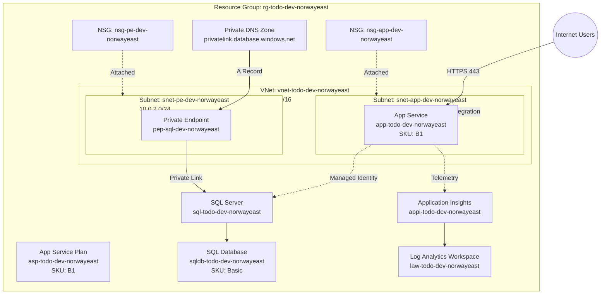

# Todo Application — Azure Infrastructure


Secure, production-ready Azure infrastructure for a Todo web application deployed to **Norway East** using **Bicep** with **Azure Verified Modules (AVM)**. Designed following **Cloud Adoption Framework (CAF)** and **Well-Architected Framework (WAF)** principles.

---

## Table of Contents

- [Architecture](#architecture)
- [Resources Deployed](#resources-deployed)
- [Prerequisites](#prerequisites)
- [Quick Start](#quick-start)
- [Project Structure](#project-structure)
- [Post-Deployment Steps](#post-deployment-steps)
- [Documentation](#documentation)
- [Security Highlights](#security-highlights)
- [WAF Compliance](#waf-compliance)

---

## Architecture



**Key design decisions:**
- SQL Database accessible **only** via Private Endpoint (no public access)
- App Service authenticates to SQL via **Managed Identity** (no passwords)
- **Azure AD-only authentication** enforced on SQL Server
- NSGs with **deny-all defaults** for both inbound and outbound
- Full observability via Application Insights, Log Analytics, 8 alert rules, and diagnostic settings

---

## Resources Deployed

| Resource | Name (CAF) | SKU / Tier |
|----------|-----------|------------|
| Resource Group | `rg-todo-dev-norwayeast` | — |
| Virtual Network | `vnet-todo-dev-norwayeast` | 10.0.0.0/16 |
| Subnet (App) | `snet-app-dev-norwayeast` | 10.0.1.0/24 |
| Subnet (PE) | `snet-pe-dev-norwayeast` | 10.0.2.0/24 |
| NSG (App) | `nsg-app-dev-norwayeast` | — |
| NSG (PE) | `nsg-pe-dev-norwayeast` | — |
| App Service Plan | `asp-todo-dev-norwayeast` | B1 (Basic) |
| App Service | `app-todo-dev-norwayeast` | Linux, .NET 8 |
| SQL Server | `sql-todo-dev-norwayeast` | — |
| SQL Database | `sqldb-todo-dev-norwayeast` | Basic (5 DTU) |
| Private Endpoint | `pep-sql-dev-norwayeast` | — |
| Private DNS Zone | `privatelink.database.windows.net` | — |
| Log Analytics | `law-todo-dev-norwayeast` | PerGB2018 |
| Application Insights | `appi-todo-dev-norwayeast` | Web |

---

## Prerequisites

| Requirement | Minimum Version | Install |
|-------------|----------------|---------|
| Azure CLI | 2.60+ | [Install Azure CLI](https://learn.microsoft.com/cli/azure/install-azure-cli) |
| Bicep CLI | 0.25+ | Bundled with Azure CLI or `az bicep install` |
| Azure subscription | — | With Contributor + User Access Administrator on target subscription |
| Entra ID | — | Object ID of a user/group for SQL admin |

---

## Quick Start

```bash
# 1. Login to Azure
az login

# 2. Set your subscription
az account set --subscription "<your-subscription-id>"

# 3. Get your Entra ID object ID (for SQL admin)
az ad signed-in-user show --query id -o tsv

# 4. Deploy the infrastructure
az deployment sub create \
  --location norwayeast \
  --template-file iac/infra/main.bicep \
  --parameters iac/infra/main.bicepparam \
  --parameters sqlAdminObjectId="<your-entra-id-object-id>"

# 5. Grant Managed Identity access to SQL (post-deployment)
# Connect to sqldb-todo-dev-norwayeast as the Entra ID admin and run:
#   CREATE USER [app-todo-dev-norwayeast] FROM EXTERNAL PROVIDER;
#   ALTER ROLE db_datareader ADD MEMBER [app-todo-dev-norwayeast];
#   ALTER ROLE db_datawriter ADD MEMBER [app-todo-dev-norwayeast];

# 6. Verify deployment
az webapp show --resource-group rg-todo-dev-norwayeast --name app-todo-dev-norwayeast --query state -o tsv
```

For detailed instructions, see the [Deployment Guide](docs/deployment-guide.md).

---

## Project Structure

```
iac/
├── README.md                       # This file
├── docs/
│   ├── architecture.md             # Architecture design with diagrams
│   ├── architecture-review.md      # WAF/CAF review (95/100)
│   ├── development-plan.md         # Task breakdown (20 tasks, 8 layers)
│   ├── test-results.md             # Bicep validation & what-if results
│   ├── deployment-guide.md         # Step-by-step deployment instructions
│   ├── operations-runbook.md       # Day-to-day operations guide
│   ├── cost-estimation.md          # Monthly cost estimates
│   └── images/                     # Diagrams and screenshots
├── infra/
│   ├── main.bicep                  # Orchestration — deploys all modules
│   ├── main.bicepparam             # Parameter values (dev environment)
│   ├── main.json                   # Compiled ARM template
│   └── modules/
│       ├── networking.bicep        # VNet, Subnets, NSGs
│       ├── database.bicep          # SQL Server, SQL DB, Private Endpoint, DNS
│       ├── webapp.bicep            # App Service Plan, Web App, VNet integration
│       ├── monitoring.bicep        # Log Analytics, Application Insights
│       └── alerts.bicep            # Metric alerts, diagnostic settings
```

### Module Dependency Chain

```
networking + monitoring (parallel)
    └─► database (depends on networking + monitoring)
        └─► webapp (depends on all three)
            └─► alerts (depends on webapp + database)
```

---

## Post-Deployment Steps

After the Bicep deployment completes, grant the Web App's Managed Identity access to the SQL Database:

1. Connect to `sqldb-todo-dev-norwayeast` using Azure Data Studio or `sqlcmd` as the Entra ID admin
2. Run the following SQL:

```sql
CREATE USER [app-todo-dev-norwayeast] FROM EXTERNAL PROVIDER;
ALTER ROLE db_datareader ADD MEMBER [app-todo-dev-norwayeast];
ALTER ROLE db_datawriter ADD MEMBER [app-todo-dev-norwayeast];
```

3. Verify the health endpoint: `https://app-todo-dev-norwayeast.azurewebsites.net/health`

---

## Documentation

| Document | Description |
|----------|-------------|
| [Architecture](docs/architecture.md) | Full architecture design, diagrams, WAF analysis, security model |
| [Architecture Review](docs/architecture-review.md) | WAF/CAF compliance review — scored 95/100 |
| [Development Plan](docs/development-plan.md) | 20 tasks across 8 layers with dependency graph |
| [Test Results](docs/test-results.md) | Syntax validation, linting, security checks, what-if output |
| [Deployment Guide](docs/deployment-guide.md) | Step-by-step deployment instructions with rollback procedures |
| [Operations Runbook](docs/operations-runbook.md) | Monitoring, troubleshooting, scaling, backup guide |
| [Cost Estimation](docs/cost-estimation.md) | Monthly cost breakdown and optimization recommendations |

---

## Security Highlights

- **No public database access** — SQL Server accessible only via Private Endpoint
- **Managed Identity** — App Service authenticates to SQL without stored credentials
- **Azure AD-only auth** — SQL authentication fully disabled (`azureADOnlyAuthentication: true`)
- **NSGs with deny-all** — Explicit allow rules for both inbound and outbound traffic
- **TLS 1.2 minimum** — Enforced on App Service and SQL Server
- **Azure Defender for SQL** — Threat detection and vulnerability assessment enabled
- **FTPS disabled** — No FTP/FTPS access to App Service
- **HTTPS-only** — HTTP traffic redirected to HTTPS

---

## WAF Compliance

| Pillar | Rating | Key Evidence |
|--------|--------|-------------|
| **Reliability** | ✅ Compliant | Health check `/health` with auto-restart, composite SLA 99.72%, backup retention |
| **Security** | ✅ Compliant | Private Endpoint, Managed Identity, NSG deny-all, TLS 1.2, Azure Defender |
| **Cost Optimization** | ✅ Compliant | Right-sized B1/Basic SKUs for dev (~$25/month total) |
| **Operational Excellence** | ✅ Compliant | Full IaC with AVM, 8 alert rules, diagnostic settings, CI/CD pipeline |
| **Performance Efficiency** | ✅ Compliant | Connection pooling, EF Core retry policies, appropriate dev SKUs |

---

## Tags

All resources are tagged per CAF tagging strategy:

| Tag | Value |
|-----|-------|
| `environment` | `dev` |
| `workload` | `todo` |
| `owner` | `hackathon-team` |
| `costCenter` | `hackathon-2026` |
