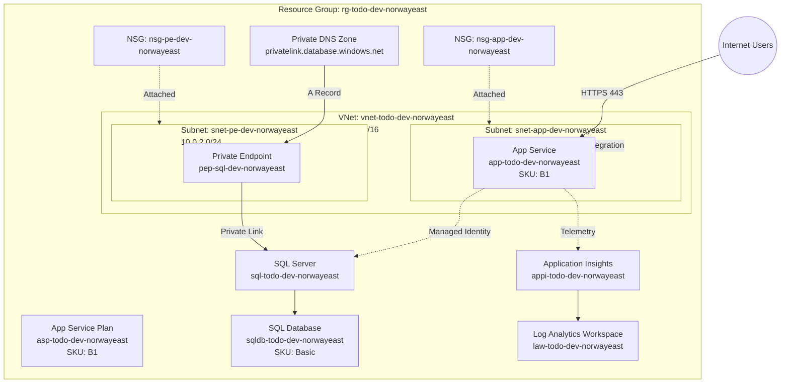
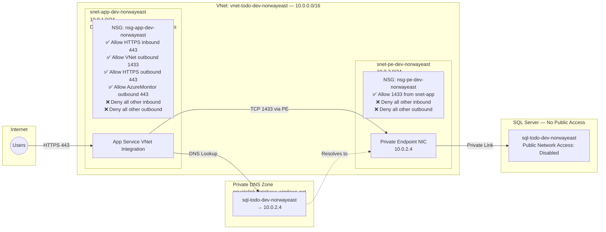

# Todo Application — Architecture Document

## 1. Executive Summary

This architecture defines a secure, production-ready Azure infrastructure for a Todo web application deployed to **Norway East**. The solution uses **Azure App Service** to host a .NET web application backed by **Azure SQL Database** for persistent storage. All database traffic flows through a **Private Endpoint** within an **Azure Virtual Network**, ensuring the database is never publicly accessible. **Network Security Groups (NSGs)** enforce least-privilege network rules with explicit deny-all defaults for both inbound and outbound traffic. **Managed Identity** eliminates the need for stored credentials, and **Azure AD-only authentication** is enforced on SQL Server. The design follows **Cloud Adoption Framework (CAF)** naming and tagging conventions, **Well-Architected Framework (WAF)** principles across all five pillars, and uses **Azure Verified Modules (AVM)** for consistent, reliable Bicep deployments. A **monitoring layer** with Log Analytics, Application Insights, alerting rules, and diagnostic settings provides full observability. A `/health` endpoint validates end-to-end connectivity including database reachability. A **CI/CD pipeline** using GitHub Actions automates build, test, and deployment. The target composite SLA for the dev environment is **99.72%**.

## 2. Architecture Diagram



> **Health Check**: The application exposes a `/health` endpoint that validates database connectivity via the Managed Identity connection. App Service health check probes this endpoint every 30 seconds, enabling automatic instance restart on failure.

## 3. Network Diagram



## 4. Resource Inventory

| Resource Name (CAF) | Resource Type | SKU / Tier | AVM Module Reference |
|---|---|---|---|
| `rg-todo-dev-norwayeast` | Resource Group | — | `br/public:avm/res/resources/resource-group:0.4.1` |
| `vnet-todo-dev-norwayeast` | Virtual Network | — | `br/public:avm/res/network/virtual-network:0.5.2` |
| `snet-app-dev-norwayeast` | Subnet | — | *(inline in VNet module)* |
| `snet-pe-dev-norwayeast` | Subnet | — | *(inline in VNet module)* |
| `nsg-app-dev-norwayeast` | Network Security Group | — | `br/public:avm/res/network/network-security-group:0.5.1` |
| `nsg-pe-dev-norwayeast` | Network Security Group | — | `br/public:avm/res/network/network-security-group:0.5.1` |
| `asp-todo-dev-norwayeast` | App Service Plan | B1 (Basic) | `br/public:avm/res/web/serverfarm:0.4.1` |
| `app-todo-dev-norwayeast` | App Service (Web App) | — | `br/public:avm/res/web/site:0.12.0` |
| `sql-todo-dev-norwayeast` | SQL Server | — | `br/public:avm/res/sql/server:0.12.0` |
| `sqldb-todo-dev-norwayeast` | SQL Database | Basic (5 DTU) | *(inline in SQL Server module)* |
| `pep-sql-dev-norwayeast` | Private Endpoint | — | `br/public:avm/res/network/private-endpoint:0.10.1` |
| `privatelink.database.windows.net` | Private DNS Zone | — | `br/public:avm/res/network/private-dns-zone:0.7.1` |
| `law-todo-dev-norwayeast` | Log Analytics Workspace | PerGB2018 | `br/public:avm/res/operational-insights/workspace:0.9.1` |
| `appi-todo-dev-norwayeast` | Application Insights | — | `br/public:avm/res/insights/component:0.4.2` |

## 5. WAF Pillar Analysis

| Design Decision | WAF Pillar(s) | Rationale |
|---|---|---|
| Private Endpoint for SQL Database | **Security**, **Reliability** | Eliminates public DB exposure; traffic stays within VNet backbone |
| NSGs with deny-all inbound AND outbound | **Security** | Least-privilege network access; explicit allow rules for both directions |
| Managed Identity (App → SQL) | **Security**, **Operational Excellence** | No stored credentials; automatic rotation; no secrets in code |
| Azure AD-only authentication on SQL | **Security** | `azureADOnlyAuthentication: true` — prevents password-based access entirely |
| TLS 1.2 enforced on all resources | **Security** | Prevents downgrade attacks; meets compliance requirements |
| App Service Plan B1 SKU | **Cost Optimization** | Right-sized for dev workload (~$13/month); upgrade to S1/P1v3 for production |
| VNet Integration for App Service | **Security**, **Reliability** | Outbound traffic routed through VNet; enables private DNS resolution |
| Application Insights + Log Analytics | **Operational Excellence**, **Performance** | Centralized telemetry; distributed tracing; proactive issue detection |
| Alerting rules (CPU, 5xx, DTU, health) | **Operational Excellence**, **Reliability** | Proactive issue detection; auto-notify on threshold breaches |
| Diagnostic settings (App Service + SQL) | **Operational Excellence** | Stream platform logs and metrics to Log Analytics for analysis |
| Azure Defender for SQL | **Security** | Threat detection, vulnerability assessment, anomaly alerting |
| IaC with AVM Bicep modules | **Operational Excellence**, **Reliability** | Repeatable, auditable deployments; version-pinned modules |
| Private DNS Zone for SQL | **Security**, **Reliability** | Enables name resolution of private endpoint within VNet |
| `/health` endpoint with DB check | **Reliability**, **Performance** | Validates database connectivity; App Service probes every 30s; auto-restart on failure |
| Short-term backup retention (7 days) | **Reliability** | Point-in-time restore for SQL Database; extend to 35 days for production |
| CI/CD pipeline (GitHub Actions) | **Operational Excellence** | Automated Bicep validation, what-if, and deployment on push |
| Connection pooling (EF Core) | **Performance Efficiency** | Pool size tuned to match DTU limits; reduces connection overhead |
| Target composite SLA: 99.72% | **Reliability** | Documented SLA target based on component SLA composition |

## 6. Security Design

### 6.1 Identity & Access

| Component | Authentication Method | Details |
|---|---|---|
| App Service → SQL Database | **System-Assigned Managed Identity** | No passwords; Azure AD-based authentication; automatic credential rotation |
| SQL Server admin | **Azure AD administrator** | Entra ID admin configured; `azureADOnlyAuthentication: true` enforced — SQL auth fully disabled |
| Deployment | **Azure CLI / Service Principal** | RBAC scoped to resource group |

### 6.2 Network Isolation

- **SQL Database**: Public network access **disabled**. Only reachable via Private Endpoint in `snet-pe-dev-norwayeast`
- **App Service**: VNet-integrated through `snet-app-dev-norwayeast`; outbound traffic routed through VNet
- **Private DNS Zone**: `privatelink.database.windows.net` linked to VNet; resolves SQL FQDN to private IP

### 6.3 Network Security Groups

**nsg-app-dev-norwayeast** (attached to `snet-app-dev-norwayeast`):

| Priority | Direction | Action | Source | Destination | Port | Purpose |
|---|---|---|---|---|---|---|
| 100 | Inbound | Allow | Internet | Any | 443 | HTTPS traffic to App Service |
| 4096 | Inbound | Deny | Any | Any | * | Deny all other inbound |
| 100 | Outbound | Allow | VirtualNetwork | VirtualNetwork | 1433 | SQL via private endpoint |
| 200 | Outbound | Allow | VirtualNetwork | Internet | 443 | HTTPS outbound (Azure services, telemetry) |
| 210 | Outbound | Allow | VirtualNetwork | AzureMonitor | 443 | Application Insights and Log Analytics |
| 4096 | Outbound | Deny | Any | Any | * | Deny all other outbound |

**nsg-pe-dev-norwayeast** (attached to `snet-pe-dev-norwayeast`):

| Priority | Direction | Action | Source | Destination | Port | Purpose |
|---|---|---|---|---|---|---|
| 100 | Inbound | Allow | 10.0.1.0/24 | Any | 1433 | SQL traffic from app subnet |
| 4096 | Inbound | Deny | Any | Any | * | Deny all other inbound |
| 4096 | Outbound | Deny | Any | Any | * | Deny all other outbound |

### 6.4 Encryption

- **In transit**: TLS 1.2 minimum enforced on App Service and SQL Server
- **At rest**: Azure-managed encryption for SQL Database (TDE enabled by default)
- **No secrets in code**: Connection strings use Managed Identity authentication format

### 6.5 Threat Protection

- **Azure Defender for SQL**: Enabled for vulnerability assessment and advanced threat protection
- **App Service**: HTTPS-only; minimum TLS 1.2; FTPS disabled

## 7. Reliability & SLA

### 7.1 Target Composite SLA

| Component | Individual SLA |
|---|---|
| App Service (B1) | 99.95% |
| SQL Database (Basic) | 99.99% |
| Private Endpoint / VNet | 99.99% |
| Private DNS Zone | 99.99% |
| **Composite SLA** | **99.72%** |

> **Calculation**: 0.9995 × 0.9999 × 0.9999 × 0.9999 ≈ 0.9972 (99.72%)

### 7.2 Health Check Endpoint

| Property | Value |
|---|---|
| Path | `/health` |
| Probe interval | 30 seconds |
| Unhealthy threshold | 3 consecutive failures |
| Checks performed | Database connectivity via Managed Identity, EF Core migration status |
| App Service setting | `healthCheckPath: /health` |

### 7.3 Backup & Recovery

| Resource | Backup Strategy | Retention |
|---|---|---|
| SQL Database | Automated backups (Azure-managed) | 7 days (dev), 35 days (prod) |
| App Service | Built-in backup (if enabled) | N/A for dev; configure for prod |
| Recovery target | Point-in-time restore within retention window | RPO: 5 minutes, RTO: 30 minutes |

## 8. Alerting Rules

### 8.1 App Service Alerts

| Alert Name | Metric | Condition | Severity |
|---|---|---|---|
| High CPU | `CpuPercentage` | > 80% for 5 minutes | Sev 2 |
| HTTP 5xx Errors | `Http5xx` | > 5 in 5 minutes | Sev 1 |
| Response Time | `HttpResponseTime` | > 2 seconds avg for 5 minutes | Sev 2 |
| Health Check Failures | `HealthCheckStatus` | < 100% for 3 minutes | Sev 1 |

### 8.2 SQL Database Alerts

| Alert Name | Metric | Condition | Severity |
|---|---|---|---|
| High DTU Usage | `dtu_consumption_percent` | > 80% for 5 minutes | Sev 2 |
| Failed Connections | `connection_failed` | > 10 in 5 minutes | Sev 1 |
| Deadlocks | `deadlock` | > 0 in 5 minutes | Sev 2 |
| Storage Usage | `storage_percent` | > 80% | Sev 3 |

## 9. Diagnostic Settings

| Resource | Log Categories | Destination |
|---|---|---|
| App Service (`app-todo-dev-norwayeast`) | `AppServiceHTTPLogs`, `AppServiceConsoleLogs`, `AppServiceAppLogs`, `AppServicePlatformLogs` | Log Analytics (`law-todo-dev-norwayeast`) |
| SQL Server (`sql-todo-dev-norwayeast`) | `SQLSecurityAuditEvents` | Log Analytics (`law-todo-dev-norwayeast`) |
| SQL Database (`sqldb-todo-dev-norwayeast`) | `SQLInsights`, `AutomaticTuning`, `QueryStoreRuntimeStatistics`, `Errors`, `Timeouts` | Log Analytics (`law-todo-dev-norwayeast`) |

## 10. AVM Module References

| Module | Registry Path | Version |
|---|---|---|
| Resource Group | `br/public:avm/res/resources/resource-group` | `0.4.1` |
| Virtual Network | `br/public:avm/res/network/virtual-network` | `0.5.2` |
| Network Security Group | `br/public:avm/res/network/network-security-group` | `0.5.1` |
| App Service Plan | `br/public:avm/res/web/serverfarm` | `0.4.1` |
| Web App (App Service) | `br/public:avm/res/web/site` | `0.12.0` |
| SQL Server | `br/public:avm/res/sql/server` | `0.12.0` |
| Private Endpoint | `br/public:avm/res/network/private-endpoint` | `0.10.1` |
| Private DNS Zone | `br/public:avm/res/network/private-dns-zone` | `0.7.1` |
| Log Analytics Workspace | `br/public:avm/res/operational-insights/workspace` | `0.9.1` |
| Application Insights | `br/public:avm/res/insights/component` | `0.4.2` |

## 11. Tags

All resources are tagged with the following strategy:

| Tag Key | Value | Purpose |
|---|---|---|
| `environment` | `dev` | Environment identifier (dev / staging / prod) |
| `workload` | `todo` | Application name |
| `owner` | `hackathon-team` | Responsible team/individual |
| `costCenter` | `hackathon-2026` | Billing code for cost allocation |

## 12. Deployment Approach

### Modular Bicep Structure

```
iac/
├── infra/
│   ├── main.bicep              # Orchestration — deploys all modules in order
│   ├── main.bicepparam         # Parameter values
│   └── modules/
│       ├── networking.bicep    # VNet, Subnets, NSGs
│       ├── database.bicep      # SQL Server, SQL Database, Private Endpoint, Private DNS Zone
│       ├── webapp.bicep        # App Service Plan, Web App, VNet Integration, Health Check
│       └── monitoring.bicep    # Log Analytics, Application Insights, Alerts, Diagnostic Settings
```

### Deployment Order (dependency chain)

1. **networking.bicep** — VNet, Subnets, NSGs with inbound+outbound deny-all (no dependencies)
2. **monitoring.bicep** — Log Analytics Workspace, Application Insights (no dependencies; parallel with networking)
3. **database.bicep** — SQL Server (`azureADOnlyAuthentication: true`), SQL Database, Private Endpoint, Private DNS Zone (depends on networking, monitoring)
4. **webapp.bicep** — App Service Plan, Web App with VNet Integration, Managed Identity, Health Check, Diagnostic Settings (depends on networking, monitoring, database)

### CI/CD Pipeline (GitHub Actions)

| Trigger | Steps |
|---|---|
| **PR to main** | Lint → Build → What-If |
| **Push to main** | Build → Deploy to `rg-todo-dev-norwayeast` |

## 13. Future Considerations (Production Upgrades)

| Area | Dev (Current) | Production (Recommended) |
|---|---|---|
| App Service SKU | B1 (1 core, 1.75 GB) | P1v3 (zone-redundant, auto-scale) |
| SQL Database SKU | Basic (5 DTU) | Standard S2+ or Serverless General Purpose |
| Caching | In-memory (`IMemoryCache`) | Azure Cache for Redis |
| WAF/DDoS | None | Azure Front Door with Web Application Firewall |
| Secrets | Managed Identity (no secrets needed) | Azure Key Vault for any additional secrets |
| Backup retention | 7 days | 35 days with geo-redundant backup |
| Multi-region | Single region (Norway East) | Active-passive with Traffic Manager |
| CDN | None | Azure CDN or Front Door for static assets |
| Auto-scaling | Not supported on B1 | S1+ with CPU/memory-based scale rules |