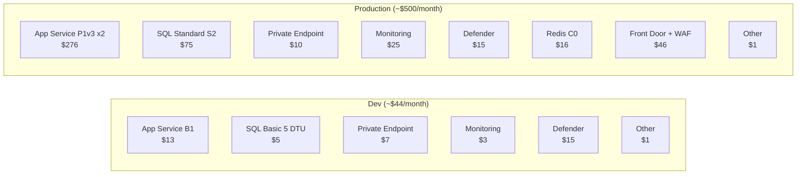

# Cost Estimation — Todo Application Infrastructure

## Table of Contents

- [Summary](#summary)
- [Dev Environment — Monthly Cost Breakdown](#dev-environment--monthly-cost-breakdown)
- [Production Environment — Estimated Monthly Costs](#production-environment--estimated-monthly-costs)
- [Dev vs. Production Cost Comparison](#dev-vs-production-cost-comparison)
- [Cost Optimization Recommendations](#cost-optimization-recommendations)
- [Azure Pricing Calculator](#azure-pricing-calculator)

---

## Summary

| Environment | Estimated Monthly Cost | Notes |
|-------------|----------------------|-------|
| **Dev** | **~$30–40/month** | Minimal SKUs, pay-per-use monitoring |
| **Production** | **~$350–500/month** | Zone-redundant, auto-scale, enhanced monitoring |

All estimates are based on Azure Norway East pricing as of March 2026. Actual costs may vary based on usage patterns.

---

## Dev Environment — Monthly Cost Breakdown

| Resource | Name | SKU / Config | Estimated Monthly Cost |
|----------|------|-------------|----------------------|
| App Service Plan | `asp-todo-dev-norwayeast` | B1 (1 core, 1.75 GB RAM) | ~$13.14 |
| SQL Database | `sqldb-todo-dev-norwayeast` | Basic (5 DTU, 2 GB) | ~$4.99 |
| SQL Server | `sql-todo-dev-norwayeast` | — (no charge for the server itself) | $0.00 |
| Virtual Network | `vnet-todo-dev-norwayeast` | 10.0.0.0/16 | $0.00 |
| Network Security Groups | `nsg-app-*`, `nsg-pe-*` | — | $0.00 |
| Private Endpoint | `pep-sql-dev-norwayeast` | Per-hour + data processing | ~$7.30 |
| Private DNS Zone | `privatelink.database.windows.net` | Per zone + queries | ~$0.50 |
| Log Analytics Workspace | `law-todo-dev-norwayeast` | PerGB2018 (pay-per-use) | ~$2–5 |
| Application Insights | `appi-todo-dev-norwayeast` | Included in Log Analytics ingestion | ~$0 (included above) |
| Metric Alert Rules | 8 rules | Standard metric alerts | ~$0.80 |
| Azure Defender for SQL | Enabled on SQL Server | Advanced threat protection | ~$15.00 |
| **Total** | | | **~$44–47/month** |

### Cost Notes — Dev

- **Log Analytics** costs depend on data ingestion volume. For a low-traffic dev environment, expect 1–5 GB/month (~$2.76/GB).
- **Private Endpoint** is charged at ~$0.01/hour + $0.01/GB processed. For dev, data processing costs are negligible.
- **Azure Defender for SQL** is the largest optional cost. It can be disabled in dev to save ~$15/month, but is recommended for security posture.
- **Application Insights** data is billed through Log Analytics ingestion. First 5 GB/month may be covered by the free tier.

---

## Production Environment — Estimated Monthly Costs

Recommended production SKUs per the architecture document (§13 Future Considerations):

| Resource | SKU / Config | Estimated Monthly Cost |
|----------|-------------|----------------------|
| App Service Plan | P1v3 (2 cores, 8 GB, zone-redundant) | ~$138.00 |
| App Service (additional instances) | Auto-scale 2–4 instances | ~$138–414 |
| SQL Database | Standard S2 (50 DTU, 250 GB) | ~$75.03 |
| Private Endpoint | Per-hour + higher data processing | ~$10.00 |
| Private DNS Zone | Per zone + queries | ~$0.50 |
| Log Analytics Workspace | PerGB2018 (higher ingestion) | ~$15–30 |
| Application Insights | Included in Log Analytics | ~$0 (included above) |
| Metric Alert Rules | 8 rules | ~$0.80 |
| Azure Defender for SQL | Advanced threat protection | ~$15.00 |
| Azure Cache for Redis | Basic C0 (250 MB) | ~$16.37 |
| Azure Front Door + WAF | Standard tier | ~$46.00 |
| **Total** | | **~$455–746/month** |

---

## Dev vs. Production Cost Comparison



| Component | Dev | Production | Difference |
|-----------|-----|-----------|------------|
| App Service Plan | $13 | $276 (2 instances) | +$263 |
| SQL Database | $5 | $75 | +$70 |
| Private Endpoint | $7 | $10 | +$3 |
| Monitoring (Log Analytics) | $3 | $25 | +$22 |
| Azure Defender | $15 | $15 | $0 |
| Redis Cache | — | $16 | +$16 |
| Front Door + WAF | — | $46 | +$46 |
| Alerts & DNS | $1 | $1 | $0 |
| **Total** | **~$44** | **~$464** | **+~$420** |

---

## Cost Optimization Recommendations

### Current Dev Environment

| # | Recommendation | Potential Savings | Trade-off |
|---|---------------|------------------|-----------|
| 1 | **Disable Azure Defender for SQL** in dev | ~$15/month | Lose threat detection; re-enable for staging/prod |
| 2 | **Stop App Service** outside business hours | ~$6/month (50% usage) | App unavailable during off-hours |
| 3 | **Reduce Log Analytics retention** to 7 days | Minimal (low volume) | Less historical data for troubleshooting |
| 4 | **Use Free tier SQL** (if available) | ~$5/month | 32 MB max size — only for minimal testing |

### Production Environment

| # | Recommendation | Potential Savings | Trade-off |
|---|---------------|------------------|-----------|
| 1 | **Use Reserved Instances** (1-year) for App Service | ~30% on compute | Upfront commitment |
| 2 | **Use Serverless SQL** (General Purpose) instead of Standard S2 | Variable — pay per usage | Performance may vary during cold starts |
| 3 | **Set Log Analytics daily cap** to prevent runaway ingestion | Prevents bill shock | May lose telemetry during high-traffic periods |
| 4 | **Configure auto-scale rules** to scale down during off-peak | ~20-40% on compute | Slightly slower response during scale-up |
| 5 | **Use Azure Hybrid Benefit** if you have SQL Server licenses | ~40% on SQL | Requires existing licenses |
| 6 | **Set up Azure Cost Management budget alerts** | $0 (operational) | Early warning on overspend |

### Budget Alert Setup

```bash
# Create a budget alert for the resource group (example: $100/month threshold)
az consumption budget create \
  --budget-name "todo-dev-budget" \
  --amount 100 \
  --category Cost \
  --time-grain Monthly \
  --start-date "2026-03-01" \
  --end-date "2027-03-01" \
  --resource-group rg-todo-dev-norwayeast
```

---

## Azure Pricing Calculator

Use the Azure Pricing Calculator to create a custom estimate for your specific configuration:

- [Azure Pricing Calculator](https://azure.microsoft.com/pricing/calculator/)
- [App Service Pricing](https://azure.microsoft.com/pricing/details/app-service/linux/)
- [Azure SQL Database Pricing](https://azure.microsoft.com/pricing/details/azure-sql-database/single/)
- [Private Link Pricing](https://azure.microsoft.com/pricing/details/private-link/)
- [Azure Monitor Pricing](https://azure.microsoft.com/pricing/details/monitor/)
- [Azure Defender for SQL Pricing](https://azure.microsoft.com/pricing/details/defender-for-cloud/)

> **Disclaimer:** All prices are estimates based on publicly available Azure pricing for the Norway East region. Actual costs depend on usage, data transfer, and any applicable discounts (EA, CSP, Reserved Instances). Always verify with the Azure Pricing Calculator for the most current rates.
