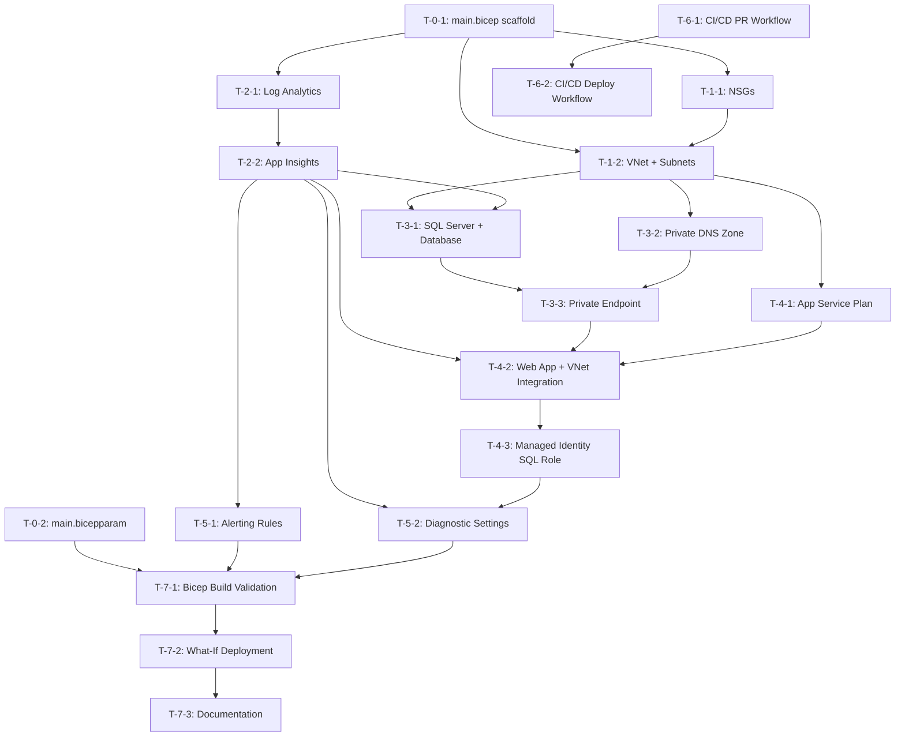

# Development Plan — Todo Application Infrastructure

**Created:** 2026-03-13
**Source:** [architecture.md](architecture.md), [architecture-review.md](architecture-review.md)
**Total Tasks:** 20
**Implementation Layers:** 8 (0–7)

---

## 1. Overview

This plan breaks the Todo application infrastructure into **20 tasks** across **8 layers**, ordered by dependency. The architecture scored **95/100** in review with all P1–P3 items already addressed. Only P4 (low-priority) enhancements remain, which are deferred to future iterations.

**Bicep modules to implement:**

| Module | File | Resources |
|---|---|---|
| Orchestration | `iac/infra/main.bicep` | Parameter definitions, module invocations |
| Parameters | `iac/infra/main.bicepparam` | Environment-specific values |
| Networking | `iac/infra/modules/networking.bicep` | VNet, 2 Subnets, 2 NSGs |
| Monitoring | `iac/infra/modules/monitoring.bicep` | Log Analytics, Application Insights |
| Database | `iac/infra/modules/database.bicep` | SQL Server, SQL Database, Private Endpoint, Private DNS Zone |
| Web App | `iac/infra/modules/webapp.bicep` | App Service Plan, Web App, VNet Integration, Managed Identity, Diagnostic Settings |

---

## 2. Dependency Graph



---

## 3. Task List by Layer

### Layer 0: Foundation

---

#### T-0-1: Scaffold main.bicep orchestration file

| Field | Value |
|---|---|
| **ID** | T-0-1 |
| **Layer** | 0 — Foundation |
| **File** | `iac/infra/main.bicep` |
| **Dependencies** | None |
| **Parallel** | Yes (with T-0-2) |
| **Description** | Create the main Bicep orchestration file with `targetScope = 'subscription'`. Define all shared parameters (`location`, `environment`, `workload`, `tags`, `sqlAdminObjectId`). Add a resource group deployment using `br/public:avm/res/resources/resource-group:0.4.1`. Add placeholder module references for networking, monitoring, database, and webapp modules with correct dependency ordering. |
| **Acceptance Criteria** | - `targetScope = 'subscription'` is set. - All parameters have `@description()` decorators. - `@secure()` on sensitive params. - Resource group `rg-todo-dev-norwayeast` is defined. - Module calls reference correct file paths. - Module dependency chain: networking + monitoring (parallel) → database (depends on both) → webapp (depends on all three). |

---

#### T-0-2: Create parameter file

| Field | Value |
|---|---|
| **ID** | T-0-2 |
| **Layer** | 0 — Foundation |
| **File** | `iac/infra/main.bicepparam` |
| **Dependencies** | None |
| **Parallel** | Yes (with T-0-1) |
| **Description** | Create the Bicep parameter file using the `.bicepparam` format. Set `location = 'norwayeast'`, `environment = 'dev'`, `workload = 'todo'`, and tag values (`environment=dev`, `workload=todo`, `owner=hackathon-team`, `costCenter=hackathon-2026`). Include `sqlAdminObjectId` placeholder. |
| **Acceptance Criteria** | - Uses `using './main.bicep'` syntax. - All required parameter values set. - `sqlAdminObjectId` included with a placeholder comment. - File passes `bicep build`. |

---

### Layer 1: Networking

---

#### T-1-1: Implement Network Security Groups

| Field | Value |
|---|---|
| **ID** | T-1-1 |
| **Layer** | 1 — Networking |
| **File** | `iac/infra/modules/networking.bicep` |
| **Dependencies** | T-0-1 |
| **Parallel** | No (T-1-2 depends on NSG resource IDs) |
| **Description** | Create the networking module. Define two NSGs using `br/public:avm/res/network/network-security-group:0.5.1`: (1) `nsg-app-dev-norwayeast` with rules: Allow HTTPS inbound (100), Deny all inbound (4096), Allow SQL outbound to VNet on 1433 (100), Allow HTTPS outbound (200), Allow AzureMonitor outbound (210), Deny all outbound (4096). (2) `nsg-pe-dev-norwayeast` with rules: Allow 1433 inbound from 10.0.1.0/24 (100), Deny all inbound (4096), Deny all outbound (4096). |
| **Acceptance Criteria** | - Both NSGs defined with AVM module. - All security rules match §6.3 of architecture doc. - Deny-all at priority 4096 for both inbound and outbound on both NSGs. - NSG resource IDs exposed as outputs for VNet subnet association. - Tags applied. |

---

#### T-1-2: Implement VNet and Subnets

| Field | Value |
|---|---|
| **ID** | T-1-2 |
| **Layer** | 1 — Networking |
| **File** | `iac/infra/modules/networking.bicep` |
| **Dependencies** | T-1-1 |
| **Parallel** | No |
| **Description** | Add VNet `vnet-todo-dev-norwayeast` (10.0.0.0/16) using `br/public:avm/res/network/virtual-network:0.5.2` with two subnets: (1) `snet-app-dev-norwayeast` (10.0.1.0/24) with delegation `Microsoft.Web/serverFarms` and `nsg-app` attached. (2) `snet-pe-dev-norwayeast` (10.0.2.0/24) with `nsg-pe` attached. |
| **Acceptance Criteria** | - VNet with correct address space. - Two subnets with correct CIDRs. - App subnet delegated to `Microsoft.Web/serverFarms`. - NSGs associated to correct subnets. - Subnet resource IDs exposed as outputs (needed by database and webapp modules). - Tags applied. |

---

### Layer 2: Monitoring

---

#### T-2-1: Implement Log Analytics Workspace

| Field | Value |
|---|---|
| **ID** | T-2-1 |
| **Layer** | 2 — Monitoring |
| **File** | `iac/infra/modules/monitoring.bicep` |
| **Dependencies** | T-0-1 |
| **Parallel** | Yes (entire Layer 2 is parallel with Layer 1) |
| **Description** | Create the monitoring module. Define Log Analytics Workspace `law-todo-dev-norwayeast` using `br/public:avm/res/operational-insights/workspace:0.9.1` with SKU `PerGB2018`. |
| **Acceptance Criteria** | - Log Analytics Workspace created with AVM module. - SKU is `PerGB2018`. - Workspace ID exposed as output for App Insights and diagnostic settings. - Tags applied. |

---

#### T-2-2: Implement Application Insights

| Field | Value |
|---|---|
| **ID** | T-2-2 |
| **Layer** | 2 — Monitoring |
| **File** | `iac/infra/modules/monitoring.bicep` |
| **Dependencies** | T-2-1 |
| **Parallel** | No (depends on Log Analytics workspace ID) |
| **Description** | Add Application Insights `appi-todo-dev-norwayeast` using `br/public:avm/res/insights/component:0.4.2` linked to the Log Analytics Workspace. |
| **Acceptance Criteria** | - Application Insights created with AVM module. - Linked to Log Analytics Workspace via `workspaceResourceId`. - Instrumentation key and connection string exposed as outputs (needed by webapp module). - Tags applied. |

---

### Layer 3: Data

---

#### T-3-1: Implement SQL Server and Database

| Field | Value |
|---|---|
| **ID** | T-3-1 |
| **Layer** | 3 — Data |
| **File** | `iac/infra/modules/database.bicep` |
| **Dependencies** | T-1-2, T-2-2 |
| **Parallel** | Yes (with T-3-2) |
| **Description** | Create the database module. Define SQL Server `sql-todo-dev-norwayeast` using `br/public:avm/res/sql/server:0.12.0` with: `azureADOnlyAuthentication: true`, Entra ID admin (parameterized `sqlAdminObjectId`), public network access disabled, `minimalTlsVersion: '1.2'`, Azure Defender enabled. Add SQL Database `sqldb-todo-dev-norwayeast` inline (Basic SKU, 5 DTU). |
| **Acceptance Criteria** | - SQL Server with Azure AD-only auth. - Public network access disabled. - TLS 1.2 enforced. - Azure Defender for SQL enabled. - SQL Database with Basic SKU (5 DTU). - Server resource ID and FQDN exposed as outputs. - Tags applied. |

---

#### T-3-2: Implement Private DNS Zone

| Field | Value |
|---|---|
| **ID** | T-3-2 |
| **Layer** | 3 — Data |
| **File** | `iac/infra/modules/database.bicep` |
| **Dependencies** | T-1-2 |
| **Parallel** | Yes (with T-3-1) |
| **Description** | Add Private DNS Zone `privatelink.database.windows.net` using `br/public:avm/res/network/private-dns-zone:0.7.1`. Link to the VNet for name resolution. |
| **Acceptance Criteria** | - Private DNS Zone created with AVM module. - VNet link established. - DNS Zone ID exposed as output for Private Endpoint. - Tags applied. |

---

#### T-3-3: Implement Private Endpoint for SQL

| Field | Value |
|---|---|
| **ID** | T-3-3 |
| **Layer** | 3 — Data |
| **File** | `iac/infra/modules/database.bicep` |
| **Dependencies** | T-3-1, T-3-2 |
| **Parallel** | No |
| **Description** | Add Private Endpoint `pep-sql-dev-norwayeast` using `br/public:avm/res/network/private-endpoint:0.10.1` in `snet-pe-dev-norwayeast`. Connect to SQL Server with `groupIds: ['sqlServer']`. Configure private DNS zone group to register A record in the Private DNS Zone. |
| **Acceptance Criteria** | - Private Endpoint in the PE subnet. - Connected to SQL Server resource. - DNS zone group links to `privatelink.database.windows.net`. - SQL Server FQDN resolves to private IP within VNet. - Tags applied. |

---

### Layer 4: Compute

---

#### T-4-1: Implement App Service Plan

| Field | Value |
|---|---|
| **ID** | T-4-1 |
| **Layer** | 4 — Compute |
| **File** | `iac/infra/modules/webapp.bicep` |
| **Dependencies** | T-1-2 |
| **Parallel** | Yes (can start once networking is ready) |
| **Description** | Create the webapp module. Define App Service Plan `asp-todo-dev-norwayeast` using `br/public:avm/res/web/serverfarm:0.4.1` with SKU `B1` (Basic, Linux). |
| **Acceptance Criteria** | - App Service Plan created with AVM module. - SKU is B1. - OS type is Linux. - Plan resource ID exposed as output. - Tags applied. |

---

#### T-4-2: Implement Web App with VNet Integration

| Field | Value |
|---|---|
| **ID** | T-4-2 |
| **Layer** | 4 — Compute |
| **File** | `iac/infra/modules/webapp.bicep` |
| **Dependencies** | T-4-1, T-3-3, T-2-2 |
| **Parallel** | No |
| **Description** | Add Web App `app-todo-dev-norwayeast` using `br/public:avm/res/web/site:0.12.0`. Configure: system-assigned Managed Identity, VNet integration with `snet-app-dev-norwayeast`, `httpsOnly: true`, `minTlsVersion: '1.2'`, `ftpsState: 'Disabled'`, `healthCheckPath: '/health'` (30s interval), Application Insights connection string in app settings. Set connection string to use Managed Identity auth format (no password). |
| **Acceptance Criteria** | - Web App created with AVM module. - System-assigned Managed Identity enabled. - VNet integration to app subnet. - HTTPS-only enforced. - TLS 1.2 minimum. - FTPS disabled. - Health check path set to `/health`. - App Insights connection string configured. - SQL connection string uses `Authentication=Active Directory Managed Identity`. - Tags applied. |

---

#### T-4-3: Configure Managed Identity SQL Role Assignment

| Field | Value |
|---|---|
| **ID** | T-4-3 |
| **Layer** | 4 — Compute |
| **File** | `iac/infra/modules/webapp.bicep` |
| **Dependencies** | T-4-2 |
| **Parallel** | No |
| **Description** | Ensure the Web App's system-assigned Managed Identity has the necessary permissions on the SQL Server. Note: Azure SQL DB role assignment (db_datareader, db_datawriter) must be done via SQL script post-deployment, not Bicep. Document the required SQL script in comments. Optionally assign Azure RBAC "SQL Server Contributor" or use the SQL-level grants approach. |
| **Acceptance Criteria** | - Managed Identity principal ID output from Web App. - SQL script documented for granting `db_datareader` and `db_datawriter` to the Managed Identity. - Clear comments in Bicep about post-deployment SQL role assignment. |

---

### Layer 5: Monitoring & Alerting

---

#### T-5-1: Implement Alerting Rules

| Field | Value |
|---|---|
| **ID** | T-5-1 |
| **Layer** | 5 — Monitoring |
| **File** | `iac/infra/modules/monitoring.bicep` |
| **Dependencies** | T-2-2 |
| **Parallel** | Yes (with T-5-2) |
| **Description** | Add 8 metric alert rules as defined in architecture §8: App Service alerts (CPU > 80%, HTTP 5xx > 5, Response Time > 2s, Health Check < 100%) and SQL Database alerts (DTU > 80%, Failed Connections > 10, Deadlocks > 0, Storage > 80%). Use native Bicep `Microsoft.Insights/metricAlerts` resources. |
| **Acceptance Criteria** | - 8 alert rules created matching §8 specifications. - Correct metric names, thresholds, evaluation windows, and severities. - Alerts scoped to the correct resources (App Service, SQL Database). - Alert rules require App Service and SQL Database resource IDs as inputs. |

---

#### T-5-2: Implement Diagnostic Settings

| Field | Value |
|---|---|
| **ID** | T-5-2 |
| **Layer** | 5 — Monitoring |
| **File** | `iac/infra/modules/monitoring.bicep` or inline in respective modules |
| **Dependencies** | T-2-1, T-4-2, T-3-1 |
| **Parallel** | Yes (with T-5-1) |
| **Description** | Configure diagnostic settings per architecture §9: App Service → Log Analytics (AppServiceHTTPLogs, ConsoleLogs, AppLogs, PlatformLogs). SQL Server → Log Analytics (SQLSecurityAuditEvents). SQL Database → Log Analytics (SQLInsights, AutomaticTuning, QueryStoreRuntimeStatistics, Errors, Timeouts). Use AVM module diagnostic settings parameters where supported, or native `Microsoft.Insights/diagnosticSettings` resources. |
| **Acceptance Criteria** | - Diagnostic settings configured for App Service (4 log categories). - Diagnostic settings configured for SQL Server (audit events). - Diagnostic settings configured for SQL Database (5 categories). - All logs routed to Log Analytics workspace. |

---

### Layer 6: CI/CD

---

#### T-6-1: Create PR validation workflow

| Field | Value |
|---|---|
| **ID** | T-6-1 |
| **Layer** | 6 — CI/CD |
| **File** | `.github/workflows/bicep-validate.yml` |
| **Dependencies** | None (can be created alongside any layer) |
| **Parallel** | Yes (with T-6-2) |
| **Description** | Create a GitHub Actions workflow triggered on PRs to `main`. Steps: (1) Checkout code, (2) Install Bicep CLI, (3) Run `az bicep lint` on all `.bicep` files, (4) Run `az bicep build` on `iac/infra/main.bicep`, (5) Run `az deployment sub what-if` with the parameter file. |
| **Acceptance Criteria** | - Workflow triggers on PR to `main`. - Lint step validates all Bicep files. - Build step compiles `main.bicep` successfully. - What-if step shows expected resource changes. - Workflow uses `azure/login` action with OIDC or service principal. |

---

#### T-6-2: Create deployment workflow

| Field | Value |
|---|---|
| **ID** | T-6-2 |
| **Layer** | 6 — CI/CD |
| **File** | `.github/workflows/bicep-deploy.yml` |
| **Dependencies** | T-6-1 |
| **Parallel** | No |
| **Description** | Create a GitHub Actions workflow triggered on push to `main`. Steps: (1) Checkout code, (2) Install Bicep CLI, (3) Azure login, (4) Run `az bicep build`, (5) Run `az deployment sub create` targeting `norwayeast` with the parameter file. Add environment protection rules (manual approval) for production. |
| **Acceptance Criteria** | - Workflow triggers on push to `main`. - Deploys to subscription scope. - Uses parameter file `iac/infra/main.bicepparam`. - Deployment targets `norwayeast` location. - Environment protection or manual gate defined. |

---

### Layer 7: Testing & Documentation

---

#### T-7-1: Bicep build and lint validation

| Field | Value |
|---|---|
| **ID** | T-7-1 |
| **Layer** | 7 — Testing |
| **File** | `iac/docs/test-results.md` |
| **Dependencies** | T-5-1, T-5-2, T-0-2 |
| **Parallel** | No |
| **Description** | Run `az bicep build --file iac/infra/main.bicep` and `az bicep lint --file iac/infra/main.bicep` locally. Validate all modules compile without errors. Document results in `iac/docs/test-results.md`. |
| **Acceptance Criteria** | - `bicep build` succeeds with zero errors. - `bicep lint` produces no warnings above severity "info". - All module references resolve. - Test results documented. |

---

#### T-7-2: What-If deployment test

| Field | Value |
|---|---|
| **ID** | T-7-2 |
| **Layer** | 7 — Testing |
| **File** | `iac/docs/test-results.md` |
| **Dependencies** | T-7-1 |
| **Parallel** | No |
| **Description** | Run `az deployment sub what-if --location norwayeast --template-file iac/infra/main.bicep --parameters iac/infra/main.bicepparam`. Verify expected resources appear in the what-if output (14 resources). Capture output in test results. |
| **Acceptance Criteria** | - What-if completes without errors. - All 14 resources from §4 appear in output. - No unexpected resource deletions or modifications. - Results appended to test results doc. |

---

#### T-7-3: Final documentation

| Field | Value |
|---|---|
| **ID** | T-7-3 |
| **Layer** | 7 — Testing |
| **File** | `iac/docs/deployment-guide.md`, `iac/README.md` |
| **Dependencies** | T-7-2 |
| **Parallel** | No |
| **Description** | Create deployment guide with: prerequisites (Azure CLI, Bicep CLI, permissions), step-by-step deployment commands, post-deployment SQL role assignment script, verification steps (health endpoint check, private endpoint connectivity test). Create `iac/README.md` with project overview and quick-start instructions. |
| **Acceptance Criteria** | - Deployment guide covers end-to-end deployment. - Post-deployment SQL script included. - Verification steps defined. - README provides quick-start for new team members. |

---

## 4. Parallel Execution Guide

```mermaid
gantt
    title Implementation Timeline by Layer
    dateFormat X
    axisFormat %s

    section Layer 0 - Foundation
    T-0-1 main.bicep scaffold       :t01, 0, 1
    T-0-2 Parameter file             :t02, 0, 1

    section Layer 1 - Networking
    T-1-1 NSGs                       :t11, 1, 2
    T-1-2 VNet + Subnets             :t12, 2, 3

    section Layer 2 - Monitoring
    T-2-1 Log Analytics              :t21, 1, 2
    T-2-2 App Insights               :t22, 2, 3

    section Layer 3 - Data
    T-3-1 SQL Server + DB            :t31, 3, 4
    T-3-2 Private DNS Zone           :t32, 3, 4
    T-3-3 Private Endpoint           :t33, 4, 5

    section Layer 4 - Compute
    T-4-1 App Service Plan           :t41, 3, 4
    T-4-2 Web App + VNet             :t42, 5, 6
    T-4-3 Managed Identity Role      :t43, 6, 7

    section Layer 5 - Monitoring Ext
    T-5-1 Alerting Rules             :t51, 3, 4
    T-5-2 Diagnostic Settings        :t52, 7, 8

    section Layer 6 - CI/CD
    T-6-1 PR Workflow                :t61, 0, 1
    T-6-2 Deploy Workflow            :t62, 1, 2

    section Layer 7 - Testing
    T-7-1 Bicep Build Validation     :t71, 8, 9
    T-7-2 What-If Deployment         :t72, 9, 10
    T-7-3 Documentation              :t73, 10, 11
```



### Parallel Work Opportunities

| Parallel Group | Tasks | Rationale |
|---|---|---|
| **Group A** | T-0-1 + T-0-2 | Foundation files have no interdependency |
| **Group B** | Layer 1 (Networking) + Layer 2 (Monitoring) | No dependency between networking and monitoring |
| **Group C** | T-3-1 + T-3-2 | SQL Server and Private DNS Zone are independent; both need networking |
| **Group D** | T-4-1 + T-5-1 | App Service Plan and alerting rules can be worked on in parallel once monitoring exists |
| **Group E** | T-5-1 + T-5-2 | Alert rules and diagnostic settings are independent |
| **Group F** | T-6-1 + T-6-2 | CI/CD workflows can be written at any time |

---

## 5. Testing Strategy

### Per-Layer Validation

| Layer | Validation Command | What to Check |
|---|---|---|
| **0 — Foundation** | `az bicep build --file iac/infra/main.bicep` | Compiles without errors; all module references resolve |
| **1 — Networking** | `az bicep build --file iac/infra/modules/networking.bicep` | NSG rules match architecture; subnet CIDRs correct; delegation set |
| **2 — Monitoring** | `az bicep build --file iac/infra/modules/monitoring.bicep` | Log Analytics and App Insights compile; workspace link correct |
| **3 — Data** | `az bicep build --file iac/infra/modules/database.bicep` | Azure AD-only auth set; public access disabled; PE configured |
| **4 — Compute** | `az bicep build --file iac/infra/modules/webapp.bicep` | VNet integration; Managed Identity; HTTPS-only; health check |
| **5 — Monitoring Ext** | `az bicep build --file iac/infra/modules/monitoring.bicep` | Alert thresholds match §8; diagnostic categories match §9 |
| **Full Stack** | `az deployment sub what-if --location norwayeast --template-file iac/infra/main.bicep --parameters iac/infra/main.bicepparam` | All 14 resources present; no unexpected changes |

### Security Validation Checklist

- [ ] SQL Server `publicNetworkAccess: 'Disabled'`
- [ ] SQL Server `azureADOnlyAuthentication: true`
- [ ] SQL Server `minimalTlsVersion: '1.2'`
- [ ] App Service `httpsOnly: true`
- [ ] App Service `minTlsVersion: '1.2'`
- [ ] App Service `ftpsState: 'Disabled'`
- [ ] NSG deny-all inbound at priority 4096 (both NSGs)
- [ ] NSG deny-all outbound at priority 4096 (both NSGs)
- [ ] Private Endpoint in PE subnet (not app subnet)
- [ ] No secrets or passwords in parameter files

---

## 6. Deployment Order

Once all Bicep files pass validation, deploy with:

```bash
# Step 1: Login to Azure
az login

# Step 2: Set subscription
az account set --subscription "<subscription-id>"

# Step 3: Validate (what-if)
az deployment sub what-if \
  --location norwayeast \
  --template-file iac/infra/main.bicep \
  --parameters iac/infra/main.bicepparam

# Step 4: Deploy
az deployment sub create \
  --location norwayeast \
  --name todo-dev-deployment \
  --template-file iac/infra/main.bicep \
  --parameters iac/infra/main.bicepparam

# Step 5: Post-deployment — Grant SQL access to Managed Identity
# Connect to SQL Database and run:
#   CREATE USER [app-todo-dev-norwayeast] FROM EXTERNAL PROVIDER;
#   ALTER ROLE db_datareader ADD MEMBER [app-todo-dev-norwayeast];
#   ALTER ROLE db_datawriter ADD MEMBER [app-todo-dev-norwayeast];

# Step 6: Verify
curl https://app-todo-dev-norwayeast.azurewebsites.net/health
```

---

## 7. Review Findings Integration

All P1–P3 findings from the architecture review are already addressed in the architecture. The P4 items are deferred:

| P4 Finding | Decision | Rationale |
|---|---|---|
| No Azure Key Vault | Deferred | Managed Identity avoids secrets; add when needed |
| No Web Application Firewall | Deferred | Dev environment; add Azure Front Door for production |
| No cost alerting | Deferred | Low risk for dev; add budget alerts for production |
| Additional tags (`createdBy`, `createdDate`) | Deferred | Nice-to-have; 4 required tags are present |
